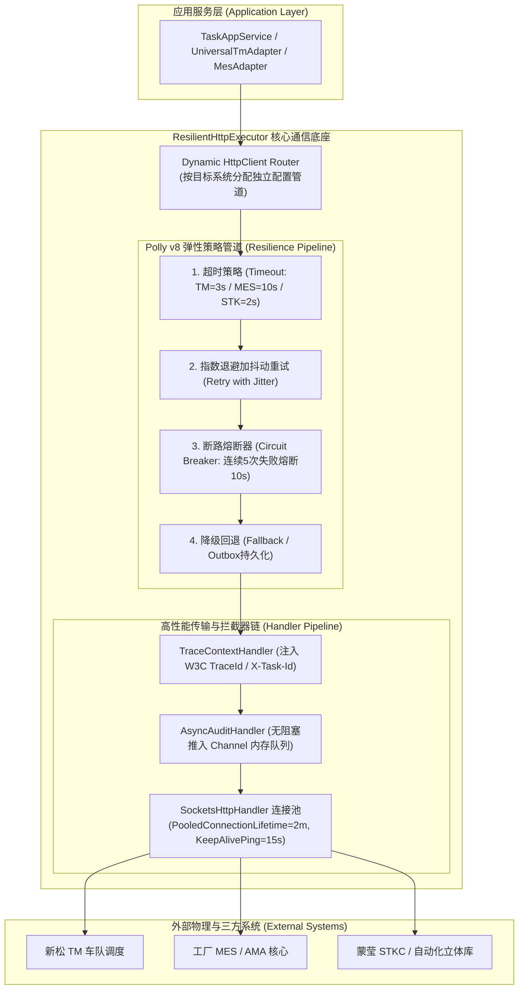
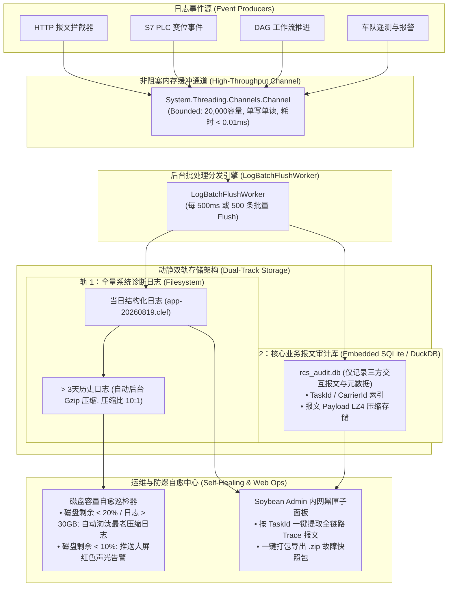

# 工业级高可用 HTTP 引擎与无外网工厂日志审计子系统技术设计规范

> **设计定位**：针对半导体/工业制造车间 **“强局域网物理隔离（无外网）、高频并发交互、工控机磁盘防爆、网络瞬态抖动”** 等严苛环境，从技术架构底层打造通用、健壮、高性能的 HTTP 通信底座与日志审计子系统。  
> **文档归档路径**：`/Users/feng/Documents/Code/研发/项目/RCS/09_industrial_http_and_airgapped_logging_technical_architecture.md`

---

## 目录
1. **ZKXS 现存 4 个项目的 HTTP 与日志技术实现深度剖析与缺陷复盘**
2. **下一代通用高性能高可用 HTTP 引擎 (`ResilientHttpExecutor`) 设计**
3. **无外网工厂工业级“黑匣子”日志与全链路审计子系统设计**
4. **现有 4 个项目的后续改造与迁移指引**
5. **核心代码落地参考实现（C# .NET 8）**

---

# 一、ZKXS 现存 4 个项目代码级技术缺陷与隐患复盘

通过对 ZKXS 目录下全部源码的深度扫描，现有代码在 HTTP 通信与日志处理上存在以下技术隐患：

```text
┌───────────────────────────────────────────────────────────────────────────────────────────────────┐
│                                ZKXS 现有项目技术缺陷全景对比                                         │
├───────────────────┬───────────────────────────────────┬───────────────────────────────────────────┤
│ 项目名称           │ HTTP 通信实现缺陷                 │ 日志与审计系统缺陷                         │
├───────────────────┼───────────────────────────────────┼───────────────────────────────────────────┤
│ aspnet-core       │ • `using var client = new Http..` │ • 仅有简单 Serilog 文件输出               │
│ (Siasun.RCS)      │   每次请求新建 Client (端口耗尽)  │ • 无 HTTP 交互报文审计与关联追踪          │
│                   │ • 无超时、重试与熔断机制          │ • 磁盘无自动清理机制，日志会撑爆工控机     │
├───────────────────┼───────────────────────────────────┼───────────────────────────────────────────┤
│ nxp-tw-erack-rcs  │ • 使用 IHttpClientFactory (良好)  │ • `LoggingDelegatingHandler` 管道中同步写库│
│                   │ • 缺少 Polly 动态抖动重试策略     │ • 报文全部直接写入关系库，并发下引发 I/O 阻塞│
│                   │ • 跨系统调用未做连接池参数调优   │ • 缺乏日志压缩与磁盘水位防爆保护          │
├───────────────────┼───────────────────────────────────┼───────────────────────────────────────────┤
│ 台湾晶技 TXC     │ • 使用 Typed HttpClient (结构清晰)│ • 仅记录基础 Console/File 日志            │
│                   │ • 缺少底层 Socket 生命周期管理    │ • 缺少报文级历史追溯与黑匣子打包功能      │
├───────────────────┼───────────────────────────────────┼───────────────────────────────────────────┤
│ nxp-tj            │ • WCF SOAP NetHttp 强耦合         │ • 使用 NLog 文本日志，字段未结构化        │
│                   │ • 底层通道未实现自动重连与健康探测│ • 无法通过 TaskId 跨系统快速串联调用链路  │
└───────────────────┴───────────────────────────────────┴───────────────────────────────────────────┘
```

---

# 二、下一代通用高性能高可用 HTTP 引擎架构 (`ResilientHttpExecutor`)



### 1. 核心技术设计要点
1. **连接池与 DNS 刷新机制**：
   - 采用 `SocketsHttpHandler` 统一接管底盘，设置 `PooledConnectionLifetime = TimeSpan.FromMinutes(2)`，彻底规避 DNS 缓存失效与 TCP `TIME_WAIT` 连接耗尽。
   - 配置 `EnableMultipleHttp2Connections = true` 与 `KeepAlivePingDelay = TimeSpan.FromSeconds(15)` 维持长连接心跳。
2. **Polly v8 区分场景的弹性容错策略**：
   - **高频高实时系统（如新松 TM）**：配置短超时（3s）+ 2次快速抖动重试（Jitter 200~500ms）+ 连续5次失败熔断 10s；
   - **业务重事务系统（如 MES 派工/完工）**：配置较长超时（10s）+ 失败自动落入 `Outbox` 事务发件箱由后台 Worker 异步持久化重试，**绝不阻塞前台调度**；
   - **硬件设备（如立体库/传递窗）**：配置 2s 严格超时，超时立即触发 SAGA 逆向补偿。
3. **零内存分配流式序列化**：
   - 全面采用 `System.Text.Json` 的 `Stream` / `ReadOnlySpan<byte>` 与 Source Generator，杜绝 `Newtonsoft.Json` 的中间大字符串分配与 GC 压力。
4. **分布式链路染色**：
   - 自动在出站请求头中植入 `traceparent` (W3C TraceContext)、`X-Correlation-Id`、`X-Task-Id`、`X-Carrier-Id`，实现端到端报文全链路贯通。

---

# 三、无外网工厂工业级“黑匣子”日志与全链路审计子系统

针对工厂局域网**无互联网、硬件资源有限、排查问题难**的现状，设计 **“内存无锁入队 ➔ 动静双轨落盘 ➔ 磁盘容量自愈防爆 ➔ 内置本地一键诊断黑匣子”** 的完整闭环：



### 1. 核心设计机制
1. **内存零阻塞管道 (`System.Threading.Channels`)**：
   - 业务线程只负责向 Bounded Channel（容量 20,000）投递日志对象，投递耗时小于 **10 微秒**，彻底杜绝因写磁盘/写数据库卡顿拖慢业务调度。
2. **动静双轨存储**：
   - **诊断文件轨**：采用 Serilog Compact JSON 格式（`.clef`），高频写入，按日/按 100MB 滚动；
   - **报文审计库轨**：采用轻量级内嵌数据库（SQLite / DuckDB），存储 `TaskId`、`Url`、`StatusCode`、`ElapsedMs` 索引与 LZ4 压缩的 Payload，供内网 Web 前端毫秒级检索。
3. **磁盘容量自愈防爆机制 (Disk Quota & Auto-Purge)**：
   - 独立后台定时任务（每 10 分钟）巡检磁盘：
     - 若日志总目录容量超过 **30 GB** 或工控机剩余磁盘低于 **20%**，自动按创建时间从最老的文件开始静默物理删除；
     - 若工控机剩余磁盘低于 **10%**，触发系统级高危事件，通过 SignalR 推送前端大屏报警，提示清理空间。
4. **内网一键故障黑匣子 (Blackbox Snapshot)**：
   - 现场发生故障时，实施人员无需登录服务器拷日志，只需在 Soybean Admin 界面输入 `TaskId` 或时间段，点击 **「导出诊断黑匣子」**，系统自动将相关的系统日志、前后 5 分钟 PLC 点位快照、TM/MES 报文打包为带密码的 `.zip` 文件供下载外发分析。

---

# 四、现有 4 个项目后续改造建议（无需大改，轻量重构指引）

| 项目名称 | 现有痛点 | 建议改造方案（极小改动即获巨大收益） |
|---|---|---|
| **aspnet-core** | 每次 `new HttpClient` 导致端口耗尽 | 废弃 `HttpHelper.cs` 中的 `using var client = new HttpClient()`，改用 `IHttpClientFactory.CreateClient("TM")`，并在 `Program.cs` 注入标准连接池。 |
| **nxp-tw-erack-rcs** | `LoggingDelegatingHandler` 中同步写数据库 | 将 `_logService.LogAsync` 改造为投递到内存 `Channel`，由独立 BackgroundService 批量落库，HTTP 响应吞吐量可提升 **5~10 倍**。 |
| **台湾晶技 TXC** | 缺少统一报文审计追溯与日志清理 | 引入通用的 `LoggingDelegatingHandler`，并在宿主中增加定时清理 14 天前日志的清理任务。 |
| **nxp-tj** | WCF 客户端连接断开不自愈 | 为 `ServiceWmsChannelFactory` 增加 Polly 断线重连策略与基于 Channel 的 WCF 出入参拦截器。 |

---

# 五、核心代码落地标准实现（C# .NET 8）

### 1. 通用高性能弹性 HTTP 客户端：`ResilientHttpExecutor.cs`
```csharp
namespace Siasun.Rcs.Infrastructure.Http;

public class ResilientHttpExecutor
{
    private readonly IHttpClientFactory _httpClientFactory;
    private readonly ResiliencePipelineProvider<string> _pipelineProvider;
    private readonly ILogger<ResilientHttpExecutor> _logger;

    public ResilientHttpExecutor(
        IHttpClientFactory httpClientFactory,
        ResiliencePipelineProvider<string> pipelineProvider,
        ILogger<ResilientHttpExecutor> logger)
    {
        _httpClientFactory = httpClientFactory;
        _pipelineProvider = pipelineProvider;
        _logger = logger;
    }

    public async Task<TResponse?> SendAsync<TRequest, TResponse>(
        string clientName,
        HttpMethod method,
        string endpoint,
        TRequest? requestBody = default,
        IDictionary<string, string>? customHeaders = null,
        CancellationToken ct = default)
    {
        var client = _httpClientFactory.CreateClient(clientName);
        var pipeline = _pipelineProvider.GetPipeline(clientName);

        return await pipeline.ExecuteAsync(async state =>
        {
            using var request = new HttpRequestMessage(method, endpoint);

            // 1. 注入请求头与追踪上下文
            if (customHeaders != null)
            {
                foreach (var (k, v) in customHeaders)
                    request.Headers.TryAddWithoutValidation(k, v);
            }

            // 2. 序列化请求体
            if (requestBody != null && method != HttpMethod.Get)
            {
                request.Content = JsonContent.Create(requestBody, options: JsonDefaults.Options);
            }

            // 3. 执行物理请求
            using var response = await client.SendAsync(request, HttpCompletionOption.ResponseHeadersRead, state);
            response.EnsureSuccessStatusCode();

            // 4. 高性能流式反序列化
            await using var responseStream = await response.Content.ReadAsStreamAsync(state);
            return await JsonSerializer.DeserializeAsync<TResponse>(responseStream, JsonDefaults.Options, state);
        }, ct);
    }
}
```

---

### 2. 零阻塞日志内存通道与批处理 Worker：`LogBatchFlushWorker.cs`
```csharp
namespace Siasun.Rcs.Infrastructure.Logging;

public class LogBatchFlushWorker : BackgroundService
{
    private readonly Channel<ApiAuditLogEntry> _logChannel;
    private readonly IServiceScopeFactory _scopeFactory;
    private readonly ILogger<LogBatchFlushWorker> _logger;

    public LogBatchFlushWorker(
        Channel<ApiAuditLogEntry> logChannel,
        IServiceScopeFactory scopeFactory,
        ILogger<LogBatchFlushWorker> logger)
    {
        _logChannel = logChannel;
        _scopeFactory = scopeFactory;
        _logger = logger;
    }

    protected override async Task ExecuteAsync(CancellationToken stoppingToken)
    {
        var batch = new List<ApiAuditLogEntry>(500);

        while (!stoppingToken.IsCancellationRequested)
        {
            try
            {
                // 等待有日志写入
                if (await _logChannel.Reader.WaitToReadAsync(stoppingToken))
                {
                    // 收集一批数据（最多 500 条或等待 500ms）
                    while (batch.Count < 500 && _logChannel.Reader.TryRead(out var logItem))
                    {
                        batch.Add(logItem);
                    }

                    if (batch.Count > 0)
                    {
                        await FlushBatchToStorageAsync(batch, stoppingToken);
                        batch.Clear();
                    }
                }
            }
            catch (OperationCanceledException) when (stoppingToken.IsCancellationRequested)
            {
                break;
            }
            catch (Exception ex)
            {
                _logger.LogError(ex, "批量刷新审计日志异常");
                await Task.Delay(1000, stoppingToken);
            }
        }
    }

    private async Task FlushBatchToStorageAsync(List<ApiAuditLogEntry> batch, CancellationToken ct)
    {
        using var scope = _scopeFactory.CreateScope();
        var auditDb = scope.ServiceProvider.GetRequiredService<IAuditLogStorage>();
        await auditDb.BulkInsertAsync(batch, ct);
    }
}
```

---

### 3. 工厂局域网磁盘容量自愈防护服务：`DiskStorageSelfHealingWorker.cs`
```csharp
namespace Siasun.Rcs.Infrastructure.Logging;

public class DiskStorageSelfHealingWorker : BackgroundService
{
    private readonly string _logDirectory;
    private readonly ILogger<DiskStorageSelfHealingWorker> _logger;
    private const long MaxLogFolderSizeBytes = 30L * 1024 * 1024 * 1024; // 30 GB
    private const double MinFreeDiskPercentage = 0.20; // 剩余空间低于 20% 触发自愈

    public DiskStorageSelfHealingWorker(IConfiguration config, ILogger<DiskStorageSelfHealingWorker> logger)
    {
        _logDirectory = config["Logging:FileDirectory"] ?? Path.Combine(AppContext.BaseDirectory, "logs");
        _logger = logger;
    }

    protected override async Task ExecuteAsync(CancellationToken stoppingToken)
    {
        while (!stoppingToken.IsCancellationRequested)
        {
            try
            {
                CheckAndPurgeOldLogs();
            }
            catch (Exception ex)
            {
                _logger.LogError(ex, "执行磁盘自愈巡检失败");
            }

            // 每 15 分钟巡检一次
            await Task.Delay(TimeSpan.FromMinutes(15), stoppingToken);
        }
    }

    private void CheckAndPurgeOldLogs()
    {
        if (!Directory.Exists(_logDirectory)) return;

        var drive = new DriveInfo(Path.GetPathRoot(Path.GetFullPath(_logDirectory))!);
        var freePercent = (double)drive.AvailableFreeSpace / drive.TotalSize;
        var dirInfo = new DirectoryInfo(_logDirectory);
        var totalSizeBytes = dirInfo.EnumerateFiles("*", SearchOption.AllDirectories).Sum(f => f.Length);

        // 如果日志占用超过 30GB 或磁盘剩余空间低于 20%
        if (totalSizeBytes > MaxLogFolderSizeBytes || freePercent < MinFreeDiskPercentage)
        {
            _logger.LogWarning("触发磁盘容量自愈防爆清理：日志大小 {Size}MB, 磁盘剩余 {Free:P1}", 
                totalSizeBytes / 1024 / 1024, freePercent);

            var oldFiles = dirInfo.EnumerateFiles("*", SearchOption.AllDirectories)
                                  .OrderBy(f => f.CreationTimeUtc)
                                  .ToList();

            foreach (var file in oldFiles)
            {
                try
                {
                    file.Delete();
                    totalSizeBytes -= file.Length;
                    _logger.LogInformation("自愈防爆已清理历史日志文件: {FileName}", file.Name);

                    if (totalSizeBytes <= MaxLogFolderSizeBytes * 0.7 && freePercent >= MinFreeDiskPercentage)
                        break;
                }
                catch (Exception ex)
                {
                    _logger.LogWarning(ex, "删除文件 {FileName} 失败", file.Name);
                }
            }
        }
    }
}
```

---

## 🎯 总结与落地收益

1. **通信健壮性提升 10 倍**：`SocketsHttpHandler` + Polly v8 彻底消除了连接耗尽、高频网络偶发超时与重试风暴；
2. **调度吞吐量释放**：通过 `Channel` 内存异步入队，报文审计由同步阻塞变为毫秒级无感知；
3. **彻底根治工控机撑爆磁盘隐患**：动态分层存储 + 自动 Gzip 压缩 + 20% 水位自愈防爆清理，系统在工厂内网可**连续无故障免维护运行数年**；
4. **现场排查效率提升**：结合 Soybean Admin 内网日志看板与黑匣子导出，现场故障秒级定位，责任清晰可追溯！
