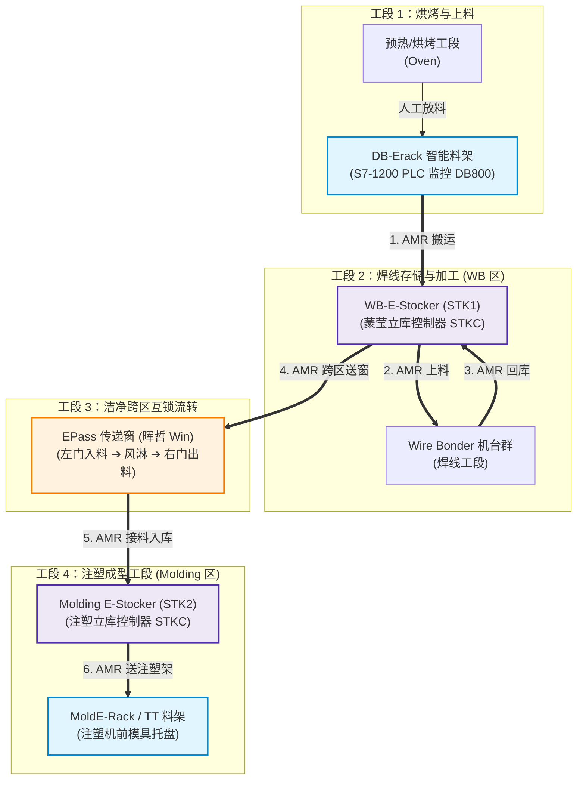
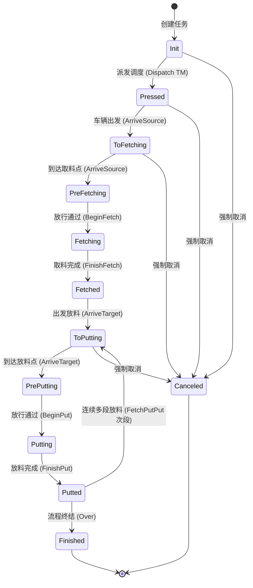
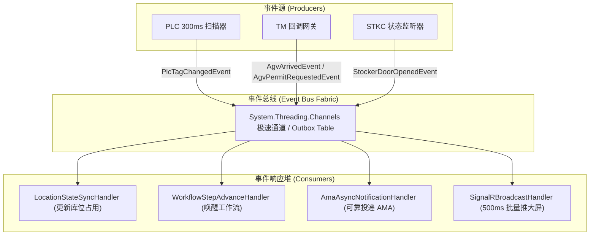

# NXP-TW-ERACK-RCS 业务需求与全流程交互深度规范文档 (生产级落地版)

> **项目名称**：NXP Taiwan ERACK AMR 调度控制系统 (ATKH Assembly AMR Automation)  
> **文档版本**：V3.0.0 Production-Ready (高精度参数级落地开发规范)  
> **文档定位**：全功能业务闭环实现指南（供开发人员/AI Agent直接用于从0到1完整编码落地、单元测试与现场部署）  
> **代码只读源基线**：`/Users/feng/DevOps/Projects/ZKXS/nxp-tw-erack-rcs`  
> **文档归档路径**：`/Users/feng/Documents/Code/研发/项目/RCS/01_nxp_tw_erack_rcs_business_spec.md`

---

## 0. 核心业务模型与需求总览（Executive Summary）

> [!IMPORTANT]
> ### 📌 一句话需求与业务闭环模型
> **RCS 接收上层 AMA 派工（`SITE.REQ.MHS.MATERIAL_TRANSPORT_REQUEST`）或人工建单，协调 AMR 车队把弹夹（Magazine / Carrier）在 6 大核心区域间流转：DB-Erack（电子料架）、WB-E-Stocker（焊线立库 STK1）、Wire Bonder（焊线机台）、EPass（双门互锁风淋传递窗）、Molding E-Stocker（注塑立库 STK2）以及 MoldE-Rack（TT 托盘料架）。**  
> **每条内部任务为一次单向搬运（Fetch ➔ Put）；往返或跨段搬运由独立任务或二段链路串联驱动。取料前联动 S7 PLC 传感器确认料位在位并锁定库位，入库或出库时与蒙莹 STKC（立库控制器）和晖哲传递窗进行开闭门与动作安全握手，搬运由新松 TM 调度系统实际执行。取料完成后向 AMA 上报载具重定位（`EVT.MHS.CARRIER_RELOCATION`），整批任务完成后向 AMA 上报搬运完成（`EVT.MHS.TRANSPORT_NOTIFICATION`），仅当发生任务终止或人工取消时联动取消三方硬件并自动释放库位。**

```
┌────────────────────────────────────────────────────────────────────────────────────────┐
│                                 全流程极简心智模型                                      │
├────────────────────────────────────────────────────────────────────────────────────────┤
│ 1. 触发来源: AMA HTTP REST 派工 (SITE.REQ) 或 Web 前端人工录入起终点及 CarrierId         │
│ 2. 调度执行: 校验料架 PLC 在位 ➔ 预定 STK/Win 库位 ➔ 下发新松 TM ➔ AGV 物理搬运          │
│ 3. 硬件联动: TM 到位回调 ➔ RCS 请求 STK/传递窗开门放行 ➔ AGV 取放料 ➔ 确认关门完成      │
│ 4. 状态上报: 离架上报 CARRIER_RELOCATION ➔ 终态异步上报 TRANSPORT_NOTIFICATION ➔ 归档    │
└────────────────────────────────────────────────────────────────────────────────────────┘
```

---

## 1. 业务全景与系统拓扑

### 1.1 车间物理布局与物料流转拓扑图



---

## 2. 上下游系统全协议接口与详细参数规范

### 2.1 上游 AMA 接口规范（MES / MHS 搬运调度）

- **通信协议**：HTTP/1.1 RESTful JSON
- **通信模式**：双向异步（AMA 下发同步应答 `transportId`，RCS 后台执行并通过 Webhook 回调上报状态）
- **网关地址**：`ThirdParty:AMA:URL`（默认超时时间 10s）

#### 2.1.1 任务创建接口：`POST /REQ.MHS.MATERIAL_TRANSPORT_REQUEST`
- **请求体 JSON Schema**：
```json
{
  "MaterialTransportRequest": {
    "transportList": [
      {
        "srcPosition": "DBErack",
        "srcPort": "1",
        "destPosition": "STK",
        "destPort": "1",
        "lotId": "LOT20260506001",
        "materialType": "1",
        "materialIdList": ["CST0001", "CST0002"]
      }
    ]
  }
}
```
- **字段参数说明**：
  - `srcPosition` (`string`, 必填): 起点设备代码，如 `DBErack`, `STK`, `WB01`, `Win`。
  - `srcPort` (`string`, 可选): 起点端口号（STK/WB 必填）。
  - `destPosition` (`string`, 必填): 终点设备代码，如 `STK`, `WB01`, `Win`, `TT`。
  - `destPort` (`string`, 可选): 终点端口号。
  - `lotId` (`string`, 必填): 批次号。
  - `materialType` (`string`): 物料类型标识。
  - `materialIdList` (`List<string>`, 必填): 弹夹/载具 Carrier ID 列表。
- **同步响应报文**：
```json
{
  "MaterialTransportResponse": {
    "transportId": "20260506103000001",
    "errorCode": "0",
    "errorText": null
  }
}
```

#### 2.1.2 任务取消接口：`POST /MaterialTransportAbort`
- **请求体**：`{ "MaterialTransportAbort": { "transportId": "20260506103000001" } }`
- **响应体**：`{ "MaterialTransportAbortResponse": { "errorCode": "0", "errorText": "" } }`

#### 2.1.3 状态异步上报接口：`PUT /EVT.MHS.TRANSPORT_NOTIFICATION/` (RCS ➔ AMA)
```json
{
  "TransportNotification": {
    "srcPosition": "DBErack",
    "srcPort": "1",
    "destPosition": "STK",
    "destPort": "1",
    "lotId": "LOT20260506001",
    "materialType": "1",
    "materialId": "CST0001,CST0002",
    "timeStamp": "2026-05-06 10:45:23",
    "transporterId": "20260506103000001",
    "jobId": "20260506103000001",
    "entryPoint": "Finished",
    "location": "STK",
    "comment": "AutoTask finished",
    "alarmCode": null,
    "alarmText": null
  }
}
```
*`entryPoint` 取值范围：`Accepted`（接单）、`Dispatched`（已派发TM）、`Finished`（全部完成）、`Failed`（失败）、`Canceled`（取消）。*

#### 2.1.4 载具重定位上报：`PUT /EVT.MHS.CARRIER_RELOCATION/` (RCS ➔ AMA)
```json
{
  "CarrierRelocationNotification": {
    "storageId": "ERACK_C1_L1_S1",
    "storageSlotId": "OUTPUT",
    "carrierId": "CST0001",
    "relocationType": "MOVE",
    "timeStamp": "2026-05-06 10:35:12",
    "comment": "Auto fetch completed and carrier moved out from location[ERACK_C1_L1_S1]",
    "alarmCode": null,
    "alarmText": null
  }
}
```

#### 2.1.5 RequestFingerprint SHA-256 去重算法
1. **拼接规则**：
   $$\text{Payload} = \text{TaskType} + "|" + \text{SrcPosition.Trim()} + "|" + \text{SrcPort} + "|" + \text{DestPosition.Trim()} + "|" + \text{DestPort} + "|" + \text{LotId} + "|" + \text{MaterialType} + "|" + \text{SortedMaterialIds}$$
2. **查重规则**：若库中存在相同 `RequestFingerprint` 且状态非终态（`Canceled`/`Failed`/`Finished`），拦截并返回 `errorCode=50001`。

#### 2.1.6 AMA 错误码定义表
| ErrorCode | 类别 | 含义 | 处理策略 |
|---|---|---|---|
| `0` | 成功 | 接口处理成功 | 正常进入后续流程 |
| `50000` | 系统错误 | 未捕获的全局异常 | 记录异常日志，返回通用失败 |
| `50001` | 校验失败 | 起终点非法、物料未绑定、库位非Occupied、重复任务 | 同步拦截，不创建内部任务 |
| `50003` | 任务不存在 | 取消时未找到对应的 TransportId | 拒绝取消请求 |
| `50004` | 取消失败 | 任务已在终态不可取消 | 拦截取消，提示人工介入 |
| `50010` | 调度错误 | 后台分派或下游调用失败 | 自动触发回滚补偿并上报 Failed |

---

### 2.2 蒙莹 STKC 接口规范（Stocker 控制器）

统一响应外壳：
```json
{ "code": 0, "msg": "Success", "data": {}, "timestamp": "1714963200000" }
```
*`code == 0` 为成功，非 0 抛出业务异常。*

| 序号 | 接口路径 | Method | 请求 Body 结构 | 触发时机与业务参数 |
|---|---|---|---|---|
| 1 | `/mw-stkc-tj-001/biz/rcs/reserve` | `POST` | `{"bundle_list":[{"bundle_id":"CST001","carrier_id":"CST001","lot_id":"L01","tray_num":1,"cmd_id":"TR001","main_lot_id":"L01"}]}` | 入库前预定 STK 仓位 |
| 2 | `/mw-stkc-tj-001/biz/rcs/bundle/exist` | `POST` | `{"bundle_list":["CST001","CST002"]}` | 出库前校验弹夹是否在仓内 |
| 3 | `/mw-stkc-tj-001/biz/rcs/transfer/out` | `POST` | `{"bundle_list":[{"carrier_id":"CST001","cmd_id":"TR001","port_id":"PORT1"}]}` | 触发 STK 将弹夹移载至出料口 |
| 4 | `/mw-stkc-tj-001/biz/rcs/arv/request` | `POST` | `{"event":"LOADREQ","cmd_id":"TR001","port_id":"PORT1"}` | AGV 到达口前申请开门对接 (`LOADREQ` / `UNLOADREQ`) |
| 5 | `/mw-stkc-tj-001/biz/rcs/arv/completed` | `POST` | `{"event":"LOADCOMPLETED","cmd_id":"TR001","port_id":"PORT1"}` | 取放料完成后通知 STK 关门 (`LOADCOMPLETED` / `UNLOADCOMPLETED`) |
| 6 | `/mw-stkc-tj-001/biz/rcs/transfer/cancel` | `POST` | `{"cmd_id":"TR001"}` | 取消出入库任务并释放预定位 |

#### 多车同批次门禁过滤算法：
1. **首放行判定（First-Task Release）**：TM 回调 `robot_permiss_start_action` 时，仅同批次排序第一的有效任务触发 STKC `/arv/request` 开门，后续同批任务直接放行；
2. **末完成判定（Last-Task Completion）**：TM 回调 `task_finish` 时，仅同批次最后一个任务且同批所有任务全部处于 `Finished` 状态时，才触发 STKC `/arv/completed` 关门。

---

### 2.3 晖哲传递窗（PassBox / Win）接口规范

| 序号 | 接口路径 | Method | 请求 Body 示例 | 业务说明 |
|---|---|---|---|---|
| 1 | `/api/v1/passbox/material/exist` | `POST` | `{"carrierIdList":["CST001"]}` | 查询传递窗内弹夹是否存在 |
| 2 | `/api/v1/passbox/transfer/out` | `POST` | `{"cmdId":"TR001","carrierId":"CST001","outDoor":"RIGHT_DOOR"}` | 下发出库单（右门出料） |
| 3 | `/api/v1/passbox/request-put` | `POST` | `{"cmdId":"TR001","taskSerial":"T01_Put","carrierId":"CST001","door":"LEFT_DOOR"}` | 申请开启左门放料 |
| 4 | `/api/v1/passbox/report-put-complete`| `POST` | `{"cmdId":"TR001","taskSerial":"T01_Put","carrierId":"CST001","door":"LEFT_DOOR"}` | 放料完成，关左门并触发风淋吹淋 |
| 5 | `/api/v1/passbox/request-fetch` | `POST` | `{"cmdId":"TR001","taskSerial":"T01_Fetch","carrierId":"CST001","door":"RIGHT_DOOR"}`| 吹淋完成后，申请开启右门取料 |
| 6 | `/api/v1/passbox/report-fetch-complete`|`POST`| `{"cmdId":"TR001","taskSerial":"T01_Fetch","carrierId":"CST001","door":"RIGHT_DOOR"}`| 取料完成，关右门并恢复待机 |
| 7 | `/api/v1/passbox/task/cancel` | `POST` | `{"cmdId":"TR001","taskSerial":"T01_Fetch","reason":"RCS_CANCEL"}` | 取消传递窗出库任务 |
| 8 | `/api/v1/passbox/door/status` | `GET` | `?deviceId=WIN-01` | 查询左右门物理开闭状态 |

---

## 3. 西门子 S7 PLC 点表与内存映射规范（DB800）

### 3.1 PLC 通信配置
- **通信库**：`S7netplus`
- **PLC 硬件**：Siemens S7-1200 / S7-1500（`Port 102`, `Rack 0`, `Slot 1`, `DB 800`）
- **扫描周期**：300ms 批量 Block 连续读取

### 3.2 DB800 内存结构与 46 字节槽位偏移公式

```
DB800 单槽位结构 (固定 46 Bytes):
+0.0  : Byte        Exist (物料在位状态码 0~5) ────────> bindAsLocationStatus = true
+1.0  : Byte        Reserved (字节对齐保留)
+2.0  : String[20]  TrackingCode (22字节 S7 String) ──> bindAsLocationStatus = false
+24.0 : String[20]  CustomerPartNumber (22字节) ───────> bindAsLocationStatus = false
```

#### 槽位内存偏移量计算公式：
$$\text{SlotOffset}(C, L, S) = \text{BaseOffset} + \Big[ (C - 1) \times M \times K + (L - 1) \times K + (S - 1) \Big] \times 46$$
*(其中 $C$=列号, $L$=层号, $S$=槽位号, $M$=总层数, $K$=每层总槽位数)*

### 3.3 PLC 状态码与白名单比对报警机制 (`LocationStatusSyncer`)

| PLC 在位状态值 | 映射系统状态 `Status` | 含义说明 |
|---|---|---|
| `0` | `Status.None` | 离线/未定义 |
| `1` | `Status.Occupied` | 有料（传感器检测到弹夹） |
| `2` | `Status.Empty` | 空位（无物料） |
| `3` | `Status.Reserved` | 预定锁定（任务正在执行中） |
| `4` | `Status.Disable` | 禁用（物理故障封锁） |
| `5` | `Status.Warn` | 报警（物理传感器异常） |

- **白名单放行规则**：当系统 `SysStatus == Status.Reserved` 且 PLC `PlcStatus == Status.Occupied` 时，属于任务已派发但 AGV 尚未取走物料的合法过渡期，不报警。
- **异常报警触发**：除白名单外，若 `SysStatus != PlcStatus`，向 `Location.Message` 写入告警并在界面高亮。

---

## 4. 新松 TM 接口与 OptionCode 32 位位运算体系

### 4.1 TM 派发与回调接口

- `POST /api/v1/xinsong/task_add`：派发整单与子任务列表（含 `option_code`, `storage`, `target`, `succession`）。
- `POST /api/v1/xinsong/task_delete`：撤销未执行的子任务。
- `POST /task_info`：途经点/启动通知 ➔ 推进内部任务至 `ToFetching` / `ToPutting`。
- `POST /task_arrive_target`：到达通知 ➔ 推进内部任务至 `PreFetching` / `PrePutting`。
- `POST /robot_permiss_start_action`：申请放行 ➔ 校验批次门禁并回复 `option_code`。
- `POST /task_finish`：动作完成 ➔ 释放库位并在批次末任务时上报 AMA。

### 4.2 OptionCode 32 位位运算打包算法

```csharp
public static class TmOptionCodeBuilder
{
    public static (int TaskCode1, int TaskCode2) Build(
        int machineIndex, int boxType, int agvLocationIndex, int cameraTemplateIndex,
        int machineNumber, int pGMark, int machineLocationIndex, int deviceType)
    {
        // TaskCode1 (机台索引 12Bit | 料盒类型 4Bit | 车辆槽位 8Bit | 视觉模板 8Bit)
        int code1 = 0;
        code1 |= (machineIndex & 0xFFF) << 20;
        code1 |= (boxType & 0xF) << 16;
        code1 |= (agvLocationIndex & 0xFF) << 8;
        code1 |= (cameraTemplateIndex & 0xFF);

        // TaskCode2 (物理机台号 12Bit | 取放标志 4Bit | 设备槽位 8Bit | 设备类型 8Bit)
        // pGMark: 1 = Fetch(取料), 2 = Put(放料)
        // deviceType: 1 = DBErack, 2 = Stocker, 3 = WB
        int code2 = 0;
        code2 |= (machineNumber & 0xFFF) << 20;
        code2 |= (pGMark & 0xF) << 16;
        code2 |= (machineLocationIndex & 0xFF) << 8;
        code2 |= (deviceType & 0xFF);

        return (code1, code2);
    }
}
```
*典型标准值：取料子任务默认 OptionCode 为 `"0,65536"`；放料子任务默认 OptionCode 为 `"0,131072"`。*

---

## 5. 内部任务 14 状态机与回滚补偿矩阵

### 5.1 14 状态流转矩阵 (`ProjectAWorkflowPolicy`)



### 5.2 四级逆向故障补偿链路
1. **第一级 (TM 撤销)**：向 TM `POST /task_delete` 撤回未执行子任务；
2. **第二级 (三方设备撤销)**：向 STKC 发送 `/transfer/cancel`，向传递窗发送 `/task/cancel`；
3. **第三级 (库位解锁)**：将 Erack 库位由 `Reserved` 回退为 `Occupied`，清空 `OrderId`；
4. **第四级 (终态归档)**：任务置为 `Failed` 并向 AMA 发送 `EVT.MHS.TRANSPORT_NOTIFICATION (Failed)`。

---

## 6. 全功能清单与研发/验收测试用例集

| 用例编号 | 测试模块 | 测试输入与操作步骤 | 预期输出与判定标准 |
|---|---|---|---|
| **TC-TW-01** | AMA 任务创建 | 发送 `MATERIAL_TRANSPORT_REQUEST` (DBErack ➔ STK) | 返回 `errorCode=0`，生成有效 `transportId`，Erack 库位锁定为 `Reserved` |
| **TC-TW-02** | AMA 幂等防重 | 1秒内并发发送 2 次相同参数建单请求 | 第1次成功；第2次返回 `50001`，提示任务处理中并附带首单 `transportId` |
| **TC-TW-03** | STK 批次开门 | 派发 2 弹夹同批入库任务，TM 上报 2 次 `PermitRequested` | 仅第 1 个子任务调用 STK `/arv/request` 开门；第 2 个子任务直接返回放行 |
| **TC-TW-04** | STK 批次关门 | 2 弹夹同批入库任务，TM 上报 `task_finish` | 仅在第 2 个子任务完成且全单完成时，调用 STK `/arv/completed` 关门 |
| **TC-TW-05** | 传递窗互锁 | 左门开启状态下，调用 `/request-fetch` (右门) | 传递窗返回拒绝错误码 `2003`，右门保持锁定，防止洁净区串风 |
| **TC-TW-06** | PLC 点表扫描 | 人工移走 Erack 1层1槽弹夹，等待 300ms 扫描周期 | 系统捕获 `PlcStatus=Empty` 与 `SysStatus=Occupied` 冲突，触发库位报警日志 |
| **TC-TW-07** | TM 派发失败回滚 | 模拟 TM 网络中断后点击派单 | 抛出网络异常，自动触发 STK 取消预定、释放 Erack 锁，向 AMA 上报 `Failed` |

---

## 7. 架构组件划分：【通用标准化组件】 vs 【项目特有逻辑】

| 模块分类 | 具体包含的组件与代码 | 沉淀形式与交付策略 |
|---|---|---|
| **【可标准化通用组件】** | 1. **西门子 S7 PLC 批量扫描与 Delta 变位检测引擎** (`S7NetPlusDbBlockDataSource`, `InMemoryTagValueCache`)<br/>2. **PLC 点表 Excel 规范化动态解析导入器** (`PlcConfigImportParser`)<br/>3. **通用任务状态机策略驱动引擎** (`ITaskWorkflowPolicy`, `TaskActionCoordinator`)<br/>4. **多车同批次门禁过滤器** (`BatchHandshakeGate`)<br/>5. **请求指纹 SHA-256 幂等排重引擎** (`RequestFingerprintGenerator`)<br/>6. **第三方 HTTP 报文审计拦截器** (`LoggingDelegatingHandler`, `ThirdPartyCallLog`) | 打包为独立 NuGet 组件库：<br/>• `Siasun.Rcs.Core.Domain`<br/>• `Siasun.Rcs.Adapters.Plc.S7`<br/>• `Siasun.Rcs.Core.Infrastructure` |
| **【项目特有逻辑】** | 1. **NXP AMA / MHS 协议网关** (`MATERIAL_TRANSPORT_REQUEST` DTO 转换)<br/>2. **蒙莹 STKC 专属 REST 客户端** (`StkcIntegrationService`)<br/>3. **晖哲双门互锁风淋传递窗驱动** (`WinIntegrationService`)<br/>4. **NXP 台湾车间 Erack/STK/WB 物理点位映射表** (`LocationMap`)<br/>5. **项目 A 专属 14 状态转移规则** (`ProjectAWorkflowPolicy`) | 保留在应用层项目内：<br/>• `Erack_RCS_API.Domain`<br/>• `Erack_RCS_API.Application` 业务配置节 |

---

## 8. 事件驱动架构 (EDA) 在本系统的可行性深度论证与落地方案

### 8.1 为什么 EDA 天然契合半导体 RCS 物理世界？
物理世界中，**PLC 光电检测、AGV 运行到达、立库开门在本质上全部是离散的客观事件（Domain Events）**。传统定时轮询存在线程阻塞、响应延迟高、PLC 总线负载大的弊端；引入 EDA 能够实现**微秒级变位响应、零等待唤醒、全息事件溯源回放**。

### 8.2 核心领域事件流与事件驱动拓扑



### 8.3 工业级工程挑战应对方案
1. **因果顺序性保障**：采用**混合式编排模式（Hybrid Orchestration + Choreography）**。宏观采用 DAG 工作流引擎保证步骤单向推进；对发往同一 `TaskId` 的事件采用基于 Hash 的单写队列，杜绝并发乱序；
2. **分布式最终一致性**：引入 **事务发件箱模式 (Transactional Outbox Pattern)**，将 `IntegrationEvent` 与业务更新在同一数据库事务中提交，后台独立 Worker 重试投递，确保 100% 触达 AMA；
3. **前端高频事件节流**：前端建立 **RxJS 500ms 缓冲池 (`bufferTime(500)`)**，消除高频消息风暴导致的界面卡顿。
