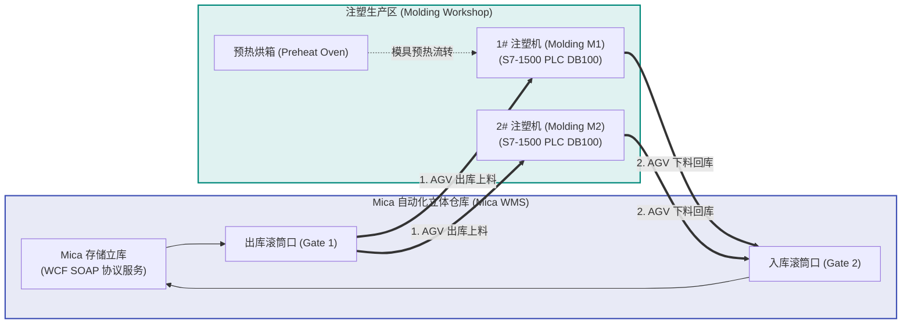
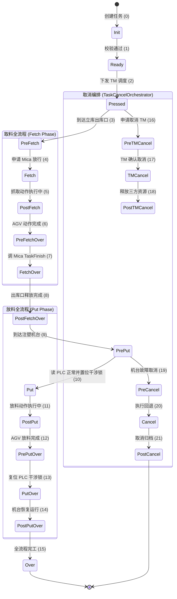
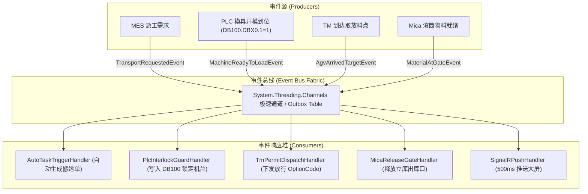

# NXP-TJ (Molding RCS) 业务需求与全流程交互深度规范文档 (生产级落地版)

> **项目名称**：NXP 天津注塑车间 RCS 调度控制系统 (NXP Tianjin Molding RCS / SiaSunRCS)  
> **文档版本**：V3.0.0 Production-Ready (高精度参数级落地开发规范)  
> **文档定位**：全功能业务闭环实现指南（供开发人员/AI Agent直接用于从0到1完整编码落地、单元测试与现场部署）  
> **代码只读源基线**：`/Users/feng/DevOps/Projects/ZKXS/nxp-tj`  
> **文档归档路径**：`/Users/feng/Documents/Code/研发/项目/RCS/02_nxp_tj_molding_rcs_business_spec.md`

---

## 0. 核心业务模型与需求总览（Executive Summary）

> [!IMPORTANT]
> ### 📌 一句话需求与业务闭环模型
> **RCS 接收 AMA/MES 搬运指令或人工建单，实现注塑车间内引线框架弹夹（Leadframe Magazine）与模具在 Mica 自动化立库（Mica WMS / Stocker）、预热烘箱与注塑机台（Molding Machine）之间的出库上料、注塑下料及回库搬运。**  
> **每条任务为一次单向搬运（Fetch ➔ Put）；往返是两次独立任务。RCS 通过 WCF SOAP 协议与 Mica WMS 交互完成出入库申请（StockOut / StockIn）、库门锁定（PlanPre）与堆垛机出库确认（Acs_StartPlanExe），通过 Sharp7 底层驱动直读直写西门子 S7-1500 PLC DB 块实现机台安全开模、光幕屏蔽与干涉区防撞硬件连锁，并由新松 TM AGV 调度执行底盘运动与取放料动作。全流程由 22 状态过程式状态机精细控制，完成或取消后记录全量交互审计日志并向上层系统反馈。**

```
┌────────────────────────────────────────────────────────────────────────────────────────┐
│                                 全流程极简心智模型                                      │
├────────────────────────────────────────────────────────────────────────────────────────┤
│ 1. 触发来源: AMA / MES 接口下发搬运指令，或 Web 界面操作员人工呼叫上料/下料               │
│ 2. 立库调度: 调用 Mica WMS SOAP 申请出库 ➔ 锁定库门 PlanPre ➔ 堆垛机就绪出库              │
│ 3. AGV 搬运: 计算 OptionCode ➔ 下发新松 TM ➔ AGV 行驶至出库口 ➔ Mica 确认放料           │
│ 4. 机台连锁: AGV 到达机台 ➔ 读 PLC DB100 确认机台停机开模 ➔ 置位干涉锁 ➔ 放料 ➔ 复位锁   │
│ 5. 状态闭环: 22 状态单向跃迁 (Init ➔ Ready ➔ Pressed ➔ Fetch ➔ Put ➔ Over) ➔ 完工归档   │
└────────────────────────────────────────────────────────────────────────────────────────┘
```

---

## 1. 业务全景与系统拓扑

### 1.1 车间物理布局与物料流转拓扑图



---

## 2. Mica WMS WCF/SOAP 协议全景规范与参数字典

### 2.1 WCF 通信协议与底层绑定配置
- **服务端终结点**：`http://10.193.226.229:9093/IPlartformComm/`（由 `MicaOptions.BaseUrl` 配置）
- **契约定义**：`IServiceWms`，TargetNamespace 为 `http://tempuri.org/`
- **协议栈**：**NetHttpBinding + BinaryMessageEncoding**（`MessageVersion.Soap12WSAddressing10`）
- **传输层配置**：`MaxReceivedMessageSize` 与 `MaxBufferSize` 设为 `10MB`

#### C# 绑定代码落地（`ServiceWmsChannelFactory.cs`）
```csharp
public static CustomBinding CreateBinding()
{
    var encoding = new BinaryMessageEncodingBindingElement
    {
        MessageVersion = MessageVersion.Soap12WSAddressing10
    };
    var transport = new HttpTransportBindingElement
    {
        MaxReceivedMessageSize = 10 * 1024 * 1024,
        MaxBufferSize = 10 * 1024 * 1024
    };
    return new CustomBinding(encoding, transport);
}
```

---

### 2.2 核心 WCF 契约方法签名与参数表

| 方法名称 | C# 异步签名 | 核心入参说明 | 返回值说明 |
|---|---|---|---|
| `StockOutRequest` | `Task<string> StockOutRequestAsync(string eqpName, string taskId, string prodId)` | `eqpName`: "mc_stocker_8"；`taskId`: Plan号；`prodId`: 弹夹RFID | JSON (`MicaResultDto`) |
| `TaskExecute` | `Task<string> TaskExecuteAsync(string eqpName, string[] taskIds, string[] gateNames, string machineId, int arvId, string urlClient)` | 批量执行出库任务；`arvId`: 2000；`gateNames`: 库口数组 | JSON (包含 `lits` 货位) |
| `TransStart` | `Task<string> TransStartAsync(string eqpName, string taskId)` | `taskId`: Plan 计划号 | JSON (`MicaResultDto`) |
| `ToAcs_CanWorkAction` | `Task<string> ToAcs_CanWorkActionAsync(string stockerName, string planNumber, string urlClient)` | 堆垛机物料送达滚筒接驳台确认 | JSON (`CanWork: true`) |
| `TaskFinish` | `Task<string> TaskFinishAsync(string eqpName, string taskId)` | `taskId`: Plan 计划号，释放立库出库口占用 | JSON (`MicaResultDto`) |
| `StockInRequest` | `Task<string> StockInRequestAsync(string eqpName, string taskId, string prodId)` | 申请入库存放 | JSON (`MicaResultDto`) |
| `TaskDelete` | `Task<string> TaskDeleteAsync(string eqpName, string taskId)` | 取消立库出入库计划 | JSON (`MicaResultDto`) |

#### SOAP 1.2 请求 Envelope 模板（以 `TaskExecute` 为例）：
```xml
<s:Envelope xmlns:s="http://www.w3.org/2003/05/soap-envelope" xmlns:a="http://www.w3.org/2005/08/addressing">
  <s:Header>
    <a:Action s:mustUnderstand="1">http://tempuri.org/IServiceWms/TaskExecute</a:Action>
    <a:To s:mustUnderstand="1">http://10.193.226.229:9093/IPlartformComm/</a:To>
  </s:Header>
  <s:Body>
    <TaskExecute xmlns="http://tempuri.org/">
      <eqpName>mc_stocker_8</eqpName>
      <taskIds xmlns:b="http://schemas.microsoft.com/2003/10/Serialization/Arrays">
        <b:string>2026080415555539524_00</b:string>
        <b:string>2026080415555539524_01</b:string>
      </taskIds>
      <gateNames xmlns:b="http://schemas.microsoft.com/2003/10/Serialization/Arrays">
        <b:string>B</b:string>
        <b:string>B</b:string>
      </gateNames>
      <machineId></machineId>
      <arvId>2000</arvId>
      <urlClient></urlClient>
    </TaskExecute>
  </s:Body>
</s:Envelope>
```

#### DTO 数据契约定义：
```csharp
public class MicaResultDto
{
    public string? Code { get; set; }     // "200" 为成功
    public string? MSG { get; set; }      // 响应消息
    public List<PlanAndPosInfoDto>? lits { get; set; }

    public bool IsSuccess(string successCode = "200")
        => string.Equals(Code, successCode, StringComparison.OrdinalIgnoreCase);
}

public class PlanAndPosInfoDto
{
    public string? planNumber { get; set; }
    public string? workLoc { get; set; }   // 库口工作区 (如 "A")
    public string? workport { get; set; }  // 滚筒口编号 (如 "1", "2")
}
```

---

## 3. 西门子 S7-1500 PLC (Sharp7) 硬件连锁与干涉区防撞

### 3.1 通信配置
- **通信库**：Sharp7 / ISO-on-TCP（TCP 102 端口）
- **机架与槽位**：S7-1500 默认 `Rack=0, Slot=1`，DB 块号为 `DB100`

### 3.2 DB100 硬件连锁点位字典与读写时序

| 变量名 | DB 物理地址 | 偏移与位 | 类型 | 方向 | 业务安全与防撞连锁逻辑 |
|---|---|---|---|---|---|
| `Molding_Ready` | `DB100.DBX0.0` | Byte 0, Bit 0 | Bool | PLC ➔ RCS (只读) | **机台停机就绪**：1=机台处于开模安全状态，允许进车；0=机台运行中禁止进车 |
| `Safety_Door_Opened`| `DB100.DBX0.1` | Byte 0, Bit 1 | Bool | PLC ➔ RCS (只读) | **安全门完全开启到位**：1=安全门打开，机械臂通道畅通；0=门未开 |
| `Curtain_Muted` | `DB100.DBX0.2` | Byte 0, Bit 2 | Bool | AGV ➔ PLC (读写) | **安全光幕屏蔽 (Muting)**：AGV驶入前置 1 屏蔽安全光栅急停；离开后置 0 |
| `AGV_In_Zone` | `DB100.DBX0.3` | Byte 0, Bit 3 | Bool | AGV ➔ PLC (读写) | **AGV进入干涉区信号**：1=机械臂进入干涉包络内，PLC硬件互锁禁止合模 |
| `Action_Finished` | `DB100.DBX0.4` | Byte 0, Bit 4 | Bool | AGV ➔ PLC (读写) | **动作完成交接脉冲**：机械臂缩回安全位后置 1，提示机台关闭安全门恢复生产 |
| `Carrier_Count` | `DB100.DBW2` | Byte 2 (2字节) | Int16 | 双向 (读写) | **弹夹数量传输**：移载的弹夹实际计数 |

---

## 4. 新松 TM 调度协议与 OptionCode 编解码体系

### 4.1 OptionCode 32 位位运算打包算法

```csharp
public static class TmOptionCodeGenerator
{
    public static (int TaskCode1, int TaskCode2) Generate(
        int count, int carrierType, int ttStart, int lotId,
        int putOrFetchFlag, int machineLocationId, int machineType)
    {
        // TaskCode1 (数量 8Bit | 料盒类型 8Bit | TT起点 8Bit | 批次低8位 8Bit)
        // carrierType: 1=小弹匣(L), 2=中弹匣(B), 3=大弹匣(H)
        int taskCode1 = ((count & 0xFF) << 24)
                      | ((carrierType & 0xFF) << 16)
                      | ((ttStart & 0xFF) << 8)
                      | (lotId & 0xFF);

        // TaskCode2 (数量 8Bit | 取放标志 8Bit | 机台编号 8Bit | 设备类型 8Bit)
        // putOrFetchFlag: 1 = Put(放料), 2 = Fetch(取料)
        // machineType: 1 = TT01, 2 = TT02, 3 = SP170, 4 = Y series
        int taskCode2 = ((count & 0xFF) << 24)
                      | ((putOrFetchFlag & 0xFF) << 16)
                      | ((machineLocationId & 0xFF) << 8)
                      | (machineType & 0xFF);

        return (taskCode1, taskCode2);
    }
}
```
*典型标准计算示例：`count=2, carrierType=1, ttStart=101, lotId=5; putOrFetchFlag=2, machineLocationId=7, machineType=3` 编译输出为 `"33621253,33687299"`。*

---

## 5. 22 状态生命周期状态机转移矩阵 (`TaskStatus`)



---

## 6. 全功能清单与研发/验收测试用例集

| 用例编号 | 测试模块 | 测试输入与操作步骤 | 预期输出与判定标准 |
|---|---|---|---|
| **TC-TJ-01** | Mica 出库齐套派单 | 传入 `MaterialIdList=["MA001", "MA002"]` | 自动拆分为 2 条 Plan，依次完成 `StockOutRequest` ➔ 批量 `TaskExecute` ➔ `TransStart`，收到放行后调 `TaskFinish`，两弹匣全部到口后下发 TM 派单 |
| **TC-TJ-02** | OptionCode 编译 | 传入小弹匣、2个料盒、SP170机台 | 正确编译出字符串 `"33621253,33687299"`，与车载视觉协议完全一致 |
| **TC-TJ-03** | PLC 干涉区防撞 | AGV 进入机台前读取 `DB100.DBX0.0` 为 0（机台未就绪） | AGV 自动在停止线等待，不强行进车，防止机械模具撞车 |
| **TC-TJ-04** | 安全取消编排 | 在 `Pressed` 状态下点击任务取消 | 自动调用 Mica `TaskDelete` + TM `task_delete`，状态原子落库为 `PostCancel`，无残留死锁 |

---

## 7. 架构组件划分：【通用标准化组件】 vs 【项目特有逻辑】

| 模块分类 | 具体包含的组件与代码 | 沉淀形式与交付策略 |
|---|---|---|
| **【可标准化通用组件】** | 1. **S7/Sharp7 PLC 通信协议栈** (`Infrastructure.Plc.Sharp7`)<br/>2. **WCF 泛型客户端与 ChannelFactory** (`ServiceWmsChannelFactory`)<br/>3. **统一任务取消编排器** (`TaskCancelOrchestrator`)<br/>4. **全量报文交互审计日志拦截器** (`TaskInteractionLogWriter`) | 打包为独立通用包：<br/>• `Siasun.Rcs.Adapters.Plc.Sharp7`<br/>• `Siasun.Rcs.Adapters.Wcf`<br/>• `Siasun.Rcs.Core.Infrastructure` |
| **【项目特有逻辑】** | 1. **Mica WMS 出库旁路编排与齐套门禁** (`MicaFlowService`)<br/>2. **Molding 车间专用 OptionCode 32 位位掩码算法** (`TaskService.ConvertInTask`)<br/>3. **弹匣 RFID 解析转换器** (`ResolveRfidAsync`)<br/>4. **天津车间机台与 ARV 点位映射字典** (`MechineArvMap`) | 保留在宿主项目层：<br/>• `NXPMoldRCS.Domain`<br/>• `NXPMoldRCS.Application` 业务配置节 |

---

## 8. 事件驱动架构 (EDA) 在本系统的可行性深度论证与落地方案

### 8.1 为什么注塑车间强烈需要 EDA 架构？
注塑车间涉及高压成型机台、重型模具、自动化立库与穿梭 AGV，其调度本质是**边沿触发的离散物理事件**（模具开模到位、AGV 进入干涉区、立库物料到口）。传统过程式 `switch-case` 与 10s 轮询存在严重的节拍浪费；通过 EDA 能够实现**毫秒级事件驱动、全流程异步化与高吞吐**。

### 8.2 核心领域事件拓扑图



### 8.3 工业级工程挑战应对方案
1. **强安全门禁隔离**：涉及人身安全与机械防撞的信号（如 PLC `AGV_In_Zone` 干涉区锁），必须在进入前通过同步 RPC 完成双向握手，绝不可使用异步弱一致性投递；非安全关键事件完全异步解耦；
2. **SAGA 逆向事务补偿**：若 AGV 动作中注塑机突发报警，SAGA 协调器立即触发补偿：通知 AGV 紧急退叉 ➔ 复位 PLC 信号 ➔ 将料盒运回立库 ➔ 记录报警日志。
