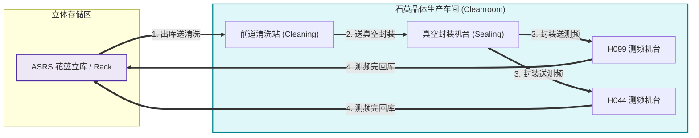

# 台湾晶技 (TXC RCS) 业务需求与全流程交互深度规范文档 (生产级落地版)

> **项目名称**：台湾晶技 (TXC) 石英晶体谐振器智能搬运 RCS 调度控制系统  
> **真实代码源基线**：`/Users/feng/DevOps/Projects/ZKXS/台湾晶技/TXC—RCS`  
> **技术栈基线**：.NET 8 + ABP DDD 架构 (后端 `TXC.RCS.API` 端口 9000) + Vue 3 (前端 `TXC.RCS.UI` Soybean Admin 端口 9527)  
> **文档版本**：V3.0.0 Production-Ready (高精度参数级落地开发规范)  
> **文档定位**：全功能业务闭环实现指南（供开发人员/AI Agent直接用于从0到1完整编码落地、单元测试与现场部署）  
> **文档归档路径**：`/Users/feng/Documents/Code/研发/项目/RCS/03_txc_taiwan_jingji_rcs_business_spec.md`

---

## 0. 核心业务模型与需求总览（Executive Summary）

> [!IMPORTANT]
> ### 📌 一句话需求与业务闭环模型
> **RCS 接收 MES 派工（`POST /api/v1/mes/Public_Job_Created`，RCS-001）或人工建单，把花篮弹夹（Carrier / Cassette）从起点（如 Stocker 立库/料架）搬运到终点（如清洗站、真空封装机台、H099/H044 测频机台），或反向。**  
> **每条任务是一次单向 Fetch/Put；往返是两次独立任务。MES 单次派工支持 1~2 条绑定任务，遵循“全成功或全失败”原子排程与 `job_id` 幂等去重。任务由新松 TM 调度实际执行，RCS 采用 Schema 驱动引擎（`txc_demo.v1.json`）动态编译 OptionCode 位参数。仅 MES 来源 的任务在 完成或取消 时通过领域事件异步上报 MES（RCS-101，`POST /Job_Finish_Report`）；失败不上报。**

```
┌────────────────────────────────────────────────────────────────────────────────────────┐
│                                 全流程极简心智模型                                      │
├────────────────────────────────────────────────────────────────────────────────────────┤
│ 1. 触发来源: MES 派工 (RCS-001) 或 Web 前端人工建单 (支持 1~2 个绑定任务)                 │
│ 2. 原子排程: 预校验起终点/库位 ➔ 命中幂等直接返回 ➔ 任一非法则整批回滚拒单 (400)            │
│ 3. 动态编译: 根据 txc_demo.v1.json Schema 动态编译 CodeA 与 CodeB (LSB 32位无损位运算)   │
│ 4. 任务执行: 微内核 TaskWorkflow 下发 TM ➔ AGV 行驶 ➔ Arrive ➔ Permit ➔ Finish         │
│ 5. 异步解耦: 任务完工发布 TaskLifecycleEndedEvent ➔ 异步上报 MES RCS-101 (Completed/Deleted)│
└────────────────────────────────────────────────────────────────────────────────────────┘
```

---

## 1. 业务全景与系统架构拓扑

### 1.1 车间搬运物理流向拓扑图



---

## 2. 上下游系统全协议接口与详细参数规范

### 2.1 MES 入站派工接口 (RCS-001)

- **HTTP Method & Path**: `POST /api/v1/mes/Public_Job_Created`
- **控制器**: `TXC.RCS.Controllers.Mes.MesJobController` (`[AllowAnonymous]`)

#### 2.1.1 请求报文 DTO (`MesPublicJobCreatedRequestDto`)
```json
{
  "request_id": "REQ202608181045001",
  "job_list": [
    {
      "job_id": "JOB_TXC_001",
      "lot_id": "LOT_CRYSTAL_9901",
      "carrier_id": "CST_A01",
      "source_location": "ERACK",
      "source_port": "1",
      "target_location": "H044",
      "target_port": "2"
    }
  ]
}
```

#### 2.1.2 响应报文 DTO (`MesApiResponseDto`)
```json
{
  "Code": "200",
  "Success": true,
  "Message": "All jobs accepted successfully",
  "DateTime": "20260818104500"
}
```

#### 2.1.3 原子校验、幂等判定与差异描述算法 (`MesJobIngressAppService.cs`)
1. **硬限制**：`job_list.Count` 必须在 1 到 2 之间，超出立即返回 `400`；
2. **列表内去重**：`job_list` 内部不允许存在重复的 `job_id`；
3. **幂等比对算法 (`MatchesMesDispatch`)**：
   比对 `FromAddress`, `FromPort`, `ToAddress`, `ToPort`, `ContainerId`, `LotId`（去除空格并忽略空串）。若完全一致，直接返回 200 幂等成功；
4. **冲突差异描述 (`DescribeMesDispatchDiff`)**：
   若已存在同名 `job_id` 但参数不一致，精确生成差异报告（如 `起点口现有=1 请求=2`），整批返回 `409`；
5. **干跑预校验 (`EnsureCanCreateAsync`)**：
   在落库前试算所有待建任务的点位与 OptionCode，任一非法整批拒绝。

---

### 2.2 MES 出站完工汇报接口 (RCS-101)

- **调用方向**: RCS (Client) ➔ MES (Server)
- **请求路由**: `POST {BaseUrl}/{JobResultReportPath}`（默认 `api/v1/mes/RCS2MES_Job_Result_Report`）

#### 2.2.1 请求报文结构 (`MesJobResultReportHttpRequest`)
```json
{
  "job_id": "JOB_TXC_001",
  "job_result": "1",
  "cancel_message": ""
}
```
*`job_result` 枚举定义：`"1"` = `Completed`（成功完成），`"2"` = `Deleted`（取消）。*

#### 2.2.2 领域事件触发机制 (`TaskLifecycleEndedEvent`)
1. **事件发布**：
   - `TaskDo.MarkSucceeded()` ➔ 发布 `TaskLifecycleEndedEvent(Id, Source, Succeeded)`；
   - `TaskDo.MarkCanceled(msg)` ➔ 发布 `TaskLifecycleEndedEvent(Id, Source, Canceled, msg)`；
2. **失败不上报规则 (Critical)**：
   - `TaskDo.MarkFailed(error)` **绝对不触发** `TaskLifecycleEndedEvent`，异常失败静默保留在 RCS 系统内部；
3. **处理器隔离 (`MesJobResultReportHandler`)**：
   - 过滤非 MES 来源任务（人工建单不上报）；
   - 使用异步安全通道上报，上报失败记录日志，不阻断核心状态落库。

---

## 3. Schema 驱动 OptionCode 动态编译器原理与位图规范

### 3.1 完整 Schema 配置文件 (`txc_demo.v1.json`)

```json
{
  "code": "txc_demo",
  "version": 1,
  "title": "TXC DEMO",
  "wire": { "join": ",", "lsbBit1": true },
  "parts": [
    {
      "key": "codeA",
      "label": "TaskCodea",
      "width": 32,
      "fields": [
        { "key": "armSide", "label": "机械臂运行侧", "bitStart": 1, "bitEnd": 8, "required": false, "source": "master", "enum": { "1": "左侧", "2": "右侧" } },
        { "key": "agvSlot", "label": "AGV库位编号", "bitStart": 9, "bitEnd": 16, "required": true, "source": "const", "constValue": 0 },
        { "key": "boxType", "label": "料盒类型", "bitStart": 17, "bitEnd": 24, "required": false, "source": "args" },
        { "key": "machineIndex", "label": "机台索引", "bitStart": 25, "bitEnd": 32, "required": false, "source": "args" }
      ]
    },
    {
      "key": "codeB",
      "label": "TaskCodeb",
      "width": 32,
      "fields": [
        { "key": "equipmentType", "label": "设备类型", "bitStart": 1, "bitEnd": 8, "required": true, "source": "master", "enum": { "1": "Rack", "2": "H099机台", "3": "H044机台" } },
        { "key": "equipmentSlot", "label": "设备库位编号", "bitStart": 9, "bitEnd": 16, "required": true, "source": "port" },
        { "key": "pickPlace", "label": "取放标识", "bitStart": 17, "bitEnd": 24, "required": true, "source": "leg", "enum": { "1": "车身到设备(P)", "2": "设备到车身(G)" } },
        { "key": "machineNo", "label": "机台编号", "bitStart": 25, "bitEnd": 32, "required": false, "source": "master" }
      ]
    }
  ]
}
```

### 3.2 数据源装配与 LSB 位运算公式 (`OptionCodeAssembler.cs` & `OptionCodeEncoder.cs`)

| 字段 Key | 位段 (1-based) | Source 类型 | 取值逻辑与数据源绑定 |
|---|---|---|---|
| `armSide` | 1~8 (8 bits) | `master` | 查询点位主数据 `StationPoint.MasterValuesJson["armSide"]` (1=左, 2=右) |
| `agvSlot` | 9~16 (8 bits) | `const` | 固定读取 Schema 常量 `constValue: 0` |
| `boxType` | 17~24 (8 bits) | `args` | 读取请求表单中的 `OptionFields["boxType"]` |
| `machineIndex` | 25~32 (8 bits) | `args` | 读取请求表单中的 `OptionFields["machineIndex"]` |
| `equipmentType`| 1~8 (8 bits) | `master` | 查询点位主数据 `StationPoint.MasterValuesJson["equipmentType"]` (1=Rack, 2=H099, 3=H044) |
| `equipmentSlot`| 9~16 (8 bits) | `port` | 动态解析传入的端口号字符串（`int.Parse(port)`） |
| `pickPlace` | 17~24 (8 bits) | `leg` | **Fetch 取料腿恒为 2 (G)；Put 放料腿恒为 1 (P)** |
| `machineNo` | 25~32 (8 bits) | `master` | 查询点位主数据 `StationPoint.MasterValuesJson["machineNo"]` |

- **LSB 模式编码位运算公式**：
  $$\text{Shift} = \text{bitStart} - 1, \quad \text{Width} = \text{bitEnd} - \text{bitStart} + 1$$
  $$\text{Mask} = (\text{Width} \ge 32) \ ? \ \text{0xFFFFFFFF} : (1\text{u} \ll \text{Width}) - 1$$
  $$\text{Word} \mid= ((\text{uint})\text{RawValue} \ \& \ \text{Mask}) \ll \text{Shift}$$
- **快照冻结机制**：任务创建时计算并调用 `FreezeOptionCodes()` 永久固化至 `TaskDo` 实体，放行回调时直接回放，杜绝主数据变更引发的指令不一致。

---

## 4. TaskWorkflow 微内核引擎与 10 步工作流模板

### 4.1 标准 10 步流程模板定义 (`WorkflowTemplateCatalog.cs`)

| 序号 | 步骤 ID (`Id`) | 等待事件 (`Wait.Event`) | 等待腿 (`Wait.Leg`) | 触发活动 (`Activity`) | 业务说明 |
|---|---|---|---|---|---|
| **0** | `dispatch` | *无 (自动执行)* | *无* | `Tm.Dispatch` | 拼装 TM 组合任务下发 `/task_add` |
| **1** | `wait_fetch_started` | `TaskStarted` | `Fetch` | *无* | 等待 TM 取货开始 (`task_info`) |
| **2** | `wait_fetch_arrived` | `Arrived` | `Fetch` | *无* | 等待 AGV 到达取货点 (`task_arrive_target`) |
| **3** | `wait_fetch_permitted`| `PermitRequested` | `Fetch` | `Tm.ReplyPermit` | 收到放行申请，回填取料 OptionCode |
| **4** | `wait_fetch_finished` | `Finished` | `Fetch` | *无* | 等待取货动作完成 (`task_finish`) |
| **5** | `wait_put_started` | `TaskStarted` | `Put` | *无* | 等待 TM 放货开始 (`task_info`) |
| **6** | `wait_put_arrived` | `Arrived` | `Put` | *无* | 等待 AGV 到达放货点 (`task_arrive_target`) |
| **7** | `wait_put_permitted` | `PermitRequested` | `Put` | `Tm.ReplyPermit` | 收到放行申请，回填放料 OptionCode |
| **8** | `wait_put_finished` | `Finished` | `Put` | *无* | 等待放货动作完成 (`task_finish`) |
| **9** | `complete` | *无 (自动执行)* | *无* | `Execution.Complete` | 标记 `Succeeded` 终态并触发 MES RCS-101 |

### 4.2 乱序与重复信号容错机制 (`WasAlreadyConsumed`)
当 TM 因网络超时重发已消费过的信号时，`TaskWorkflow.SignalAsync` 通过 `WasAlreadyConsumed` 判断当前步骤索引已超过该信号对应的步骤，系统**幂等回放 OptionCode 响应，但不推进状态机**，杜绝步骤自增导致的流程混乱。

---

## 5. 新松 TM 回调控制器与通配路由规范

### 5.1 Endpoint 映射表 (`TmCallbackController.cs`)
- **路由前缀**: `POST /api/v1/xinsong/*` (`[AllowAnonymous]`)

| 接口路由 | 映射领域事件 | 说明 |
|---|---|---|
| `POST /api/v1/xinsong/task_info` | `TaskEvents.TaskStarted` | 车辆启动子任务 |
| `POST /api/v1/xinsong/task_arrive_target` | `TaskEvents.Arrived` | AGV 到达目标点 |
| `POST /api/v1/xinsong/robot_permiss_start_action` | `TaskEvents.PermitRequested` | 申请动作许可，回复 OptionCode |
| `POST /api/v1/xinsong/task_finish` | `TaskEvents.Finished` | 子任务动作完成 |

#### 许可放行回复报文样例：
```json
{
  "Result": true,
  "ErrMsg": "",
  "data": {
    "option_code": "1,16908801",
    "task_serial": "JOB_TXC_001_GET_20260818104500"
  }
}
```

---

## 6. 前端 Vue 3 Soybean Admin 架构与组件交互

### 6.1 核心视图与组件结构
- `src/views/task/index.vue`：任务总览看板（带自适应分页与自动轮询）；
- `src/views/task/modules/task-monitor-modal.vue`：任务监控抽屉（概要/10步流程图/交互日志）；
- `src/views/task/modules/task-monitor-stepper.vue`：物理步进条（节点脉冲动画与高亮）；
- `src/composables/use-master-field-meta.ts`：OptionCode 逆向解析 Hook（将 `armSide=1` 逆向解析为 `左侧`）。

---

## 7. 全功能清单与研发/验收测试用例集

| 用例编号 | 测试模块 | 测试输入与操作步骤 | 预期输出与判定标准 |
|---|---|---|---|
| **TC-TXC-01** | MES 单任务创建 | 发送 `Public_Job_Created` (1条任务) | 返回 `Code="200"`, `Success=true`, 启动 10 步工作流并下发 TM |
| **TC-TXC-02** | MES 双任务原子创建 | 发送 `Public_Job_Created` (2条任务，其中1条点位非法) | 整批返回 `400`，数据库无任何残留任务落库，保证原子性 |
| **TC-TXC-03** | MES 幂等判定 | 重复发送完全相同的 `Public_Job_Created` | 返回 `200` 成功，不重复下发 TM 运单 |
| **TC-TXC-04** | MES 冲突判定 | 发送相同 `job_id` 但修改起点端口 | 返回 `409` 冲突，并在响应附带字段差异描述 |
| **TC-TXC-05** | OptionCode 编码 | 传入 `armSide=1, equipmentType=1, equipmentSlot=2, pickPlace=2, machineNo=1` | 编码输出严格等于 `"1,16908801"` |
| **TC-TXC-06** | 完工上报事件 | 任务步进至 `complete` 触发 `MarkSucceeded` | 自动调用 MES `Job_Finish_Report` (`job_result="1"`) |
| **TC-TXC-07** | 取消上报事件 | 操作员手动取消 MES 来源任务 | 自动调用 MES `Job_Finish_Report` (`job_result="2"`, `cancel_message="User cancel"`) |
| **TC-TXC-08** | 失败不上报 | 任务因硬件异常触发 `MarkFailed` | 系统静默隔离，**严禁**向 MES 发送 `Job_Finish_Report` |

---

## 8. 架构组件划分：【通用标准化组件】 vs 【项目特有逻辑】

| 模块分类 | 具体包含的组件与代码 | 沉淀形式与交付策略 |
|---|---|---|
| **【可标准化通用组件】** | 1. **TaskWorkflow 声明式微内核引擎** (`ITaskWorkflow`, `WorkflowTemplateCatalog`)<br/>2. **OptionCode JSON Schema 动态编译器** (`OptionCodeEncoder`, `OptionCodeAssembler`)<br/>3. **新松 TM 标准适配器** (`ITmClient`, `TmCallbackController`, `TmCallbackAppService`)<br/>4. **全量报文交互追踪器** (`ITaskInteractionLogger`, `TaskInteractionLog`)<br/>5. **前端 10 步脉冲步进条与监控组件** (`TaskMonitorStepper`, `useMasterFieldMeta`) | 打包为独立通用包：<br/>• `Siasun.Rcs.Core.Workflow`<br/>• `Siasun.Rcs.Adapters.Tm.Siasun`<br/>• 前端 `@rcs/ui-components` |
| **【项目特有逻辑】** | 1. **`txc_demo.v1.json` Schema 配置文件** (晶技 32 位位图字段)<br/>2. **MES RCS-001 / RCS-101 厂商协议实现** (`MesJobController`, `MesJobIngressAppService`)<br/>3. **晶技车间点位主数据映射表** (`ERACK`, `H044`, `H099`)<br/>4. **MES 双任务原子性校验与差异比对** (`DescribeMesDispatchDiff`) | 保留在宿主项目层：<br/>• `TXC.RCS.Domain`<br/>• `TXC.RCS.HttpApi` MES 专属控制器 |

---

## 9. 事件驱动架构 (EDA) 在本系统的可行性深度论证与落地方案

### 9.1 为什么 TXC RCS 是全面落地 EDA 的标杆范式？
在 `TXC—RCS` 代码中，已经成功落地了领域事件总线（`TaskLifecycleEndedEvent` ➔ `MesJobResultReportHandler`）。将该模式推广至全生命周期：
1. **读写分离与高吞吐**：AGV 毫秒级回调只需写库并发布领域事件，外部 MES 网络 IO、日志落盘、前端推送全部异步化；
2. **事件幂等滑动窗口**：在事件消费端建立 30 秒 Redis/MemoryCache 滑动窗口，基于 `EventId` 彻底消除重复消费。
