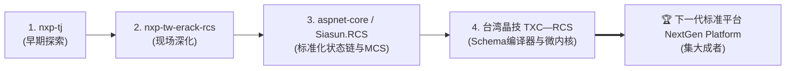

# 四大 RCS 项目深度对比、缺陷剖析与设计优势总结报告 (生产级架构版)

> **对比项目**：
> 1. `nxp-tw-erack-rcs` (NXP 台湾 ATKH 厂区 ERACK AMR 调度系统)
> 2. `nxp-tj` (NXP 天津注塑车间 Molding RCS 调度系统)
> 3. `台湾晶技 (TXC—RCS)` (台湾晶技 TXC 石英晶体搬运 RCS 调度系统)  
> 4. `aspnet-core (Siasun.RCS)` (半导体前道晶圆 FOUP/FOSB 搬运 RCS 调度系统)  
> **文档版本**：V4.0.0 Multi-Project Comparative Architecture Review  
> **文档归档路径**：`/Users/feng/Documents/Code/研发/项目/RCS/04_projects_comparative_analysis_and_issues.md`

---

## 一、四大 RCS 系统全维度横向对比矩阵

| 评估维度 | 1. NXP-TW (nxp-tw-erack-rcs) | 2. NXP-TJ (Molding_RCS) | 3. 台湾晶技 (TXC—RCS) | 4. 晶圆搬运 (aspnet-core / Siasun.RCS) | 下一代标准平台 (NextGen Platform) |
|---|---|---|---|---|---|
| **应用工段** | 晶圆封测、烘烤料架、焊线机台、传递窗 | 注塑车间、模具仓储、成型机台 | 晶体谐振器封装、贴片、清洗、测频 | **半导体前道 Sorter/Prober/Stocker/Rack** | 全工业/半导体搬运通用 |
| **搬运物料** | Leadframe Magazine (弹夹) | Leadframe Magazine (弹夹) | Cassette (花篮弹夹) | **12寸晶圆 FOUP / FOSB 晶圆盒** | 标准化载具聚合根 |
| **基础框架** | .NET 8 + ABP Framework | .NET 8 + ABP Framework | .NET 8 + ABP Framework | **.NET 8 + ABP Framework** | **.NET 8/9 LTS + 微内核 (可选 ABP)** |
| **前端架构** | Vue 3 (Soybean Admin / Vite) | Vue 3 + React（双版本历史包袱） | Vue 3 (Soybean Admin / Vite / NaiveUI) | 无独立前端（仅后端纯 API 框架） | **Soybean Admin Vue 3 + TS + NaiveUI** |
| **状态驱动方式** | `ITaskWorkflowPolicy` (模式匹配) | `TaskStatus` 过程式 22 状态枚举 | `TaskWorkflow` 10步声明式 Activity 模板 | **`RcsTaskStatusChain` 配置化状态链** 🌟 | **声明式 DAG 工作流微内核 + EDA 反应堆** |
| **同步/异步交互** | 过程式直接驱动 | 过程式直接驱动 | 步骤挂起与异步唤醒 | **`Pre / Post` 明确区分同步申请与异步放行** 🌟 | **声明式挂起等待 + 补偿事务机制** |
| **OptionCode 处理** | 硬编码位运算（嵌入 Controller） | 硬编码位运算（嵌入 Service） | **Schema 驱动动态编译器 (`txc_demo.v1.json`)** 🏆 | `TmAdapter` 内部根据 TaskType 前缀解析 | **可视化 Schema 编译器 + 动态位图引擎** |
| **TM AGV 协议** | 手写 HttpPost + 2180行 God Controller | 手写 HttpPost + 过程式状态转移 | `ITmClient` + `SimulationTmClient` | `TmAdapter` + 统一网关 `/api/v1/xinsong/*` | **`UniversalTmAdapter` + VDA 5050 双模驱动** |
| **上层调度系统** | NXP AMA (REST) | NXP AMA (REST) | MES (REST RCS-001/101) | **MCS (Material Control System REST)** 🌟 | **通用 Ingress 网关 + Transactional Outbox** |
| **车队状态建模** | 简单 ID 字符串 | 简单 ID 字符串 | 简单 ID 字符串 | **独立 `ARVEntity` 聚合根 + 故障码字典库** 🌟 | **全生命周期车队数字孪生聚合根** |
| **物料在位溯源** | 离架上报 CARRIER_RELOCATION | 本地 Plan 状态跟踪 | 完工上报 MES | **`MaterialLocationChanged` (车上/站内精准追踪)** 🌟 | **全息物料位置事件追踪器** |
| **仓储/立库 (ASRS)**| 蒙莹 STKC (REST / JSON 握手) | Mica WMS (WCF SOAP NetHttp 协议) | 无立库 (机台 ↔ 机台 / 电子料架) | Stocker 库口对接 | **`IStockerAdapter` 抽象出站端口** |
| **PLC 工业互联** | **S7NetPlus + PLCTag/Group 引擎** 🏆 | Sharp7 直读直写 DB 块 (过程式) | 无 PLC 硬件直接对接 | 无 PLC 硬件直接对接 | **工业级 S7/Modbus 批量扫描缓存引擎** |
| **跨区互锁/门禁** | 晖哲双门互锁风淋传递窗 (REST) | 无 | 无 | 无 | **`IPassboxAdapter` / `IInterlockManager`** |
| **交互审计与追踪** | `ThirdPartyCallLog` 报文拦截 🏆 | `TaskInteractionLog` 数据库记录 | `TaskInteractionLogger` | `HttpHelper` 统一记录 SendLog/GetLog | **OpenTelemetry 分布式链路 + 报文审计** |

---

## 二、各系统演进脉络与痛点剖析

### 2.1 四大系统的核心演进与贡献：
1. **`nxp-tj`**：完成了对西门子 S7-1500 PLC 底层驱动封装（Sharp7）与复杂立库（Mica WCF SOAP）的出库编排探索。痛点是状态机过程式硬编码、22 状态臃肿。
2. **`nxp-tw-erack-rcs`**：创新落地了**工业级 S7 PLC 点表批量扫描引擎 (`PLCEngine`)** 与 **全量 API 审计拦截器 (`ThirdPartyCallLog`)**。痛点是 Controller 膨胀（2180+行）与业务混杂。
3. **`aspnet-core (Siasun.RCS)`**：首次尝试将状态流转抽象为 **`appsettings.json` 可配置的 `RcsTaskStatusChain`**，创新引入了 **`Pre / Post` 同步与异步消息模式**，并建立了 **独立的 `ARVEntity` 车队聚合根与物料位置精准溯源机制**。痛点是 OptionCode 仍靠前缀硬解析，缺少前端大屏。
4. **`台湾晶技 (TXC—RCS)`**：全面吸收前期经验，首创了 **基于 JSON Schema 的 OptionCode 动态位图编译器 (`OptionCodeAssembler`)** 和 **10 步声明式 Activity 工作流 (`TaskWorkflow`)**，并配套了高度现代化的 Vue3 Soybean 前端。

---

## 三、下一代标准 RCS 平台的集大成设计建议

下一代平台应完美融合四大项目的全部精华：
1. **采用 `TXC—RCS` 的 Schema 驱动 OptionCode 动态编译器**，彻底根除位运算硬编码；
2. **采用 `aspnet-core` 的 `Pre / Post` 状态链思想与独立 `ARVEntity` 故障码字典库**；
3. **采用 `nxp-tw-erack-rcs` 的西门子 S7 批量扫描与 Delta 变位检测缓存引擎**；
4. **采用 `TXC—RCS` 的 Vue3 Soybean 前端与脉冲步进看板**；
5. **升级接入「UniversalTmAdapter + VDA 5050 双模驱动」**，天然兼容 2026 最新版新松 12 端点调度协议与国际多厂商 AGV 混跑！
