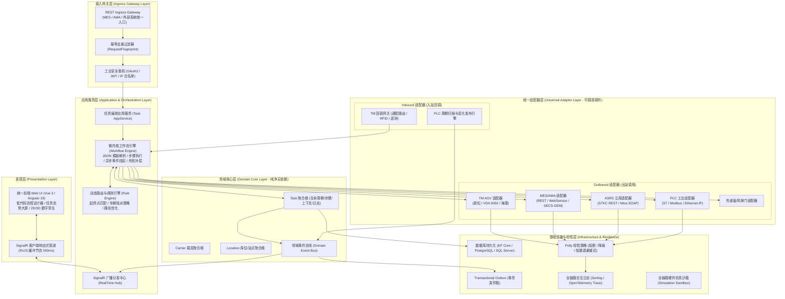
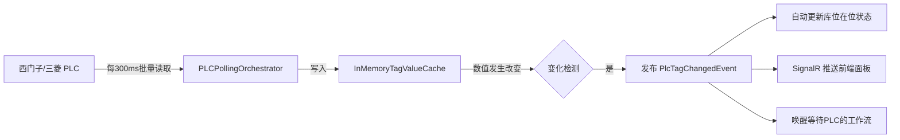
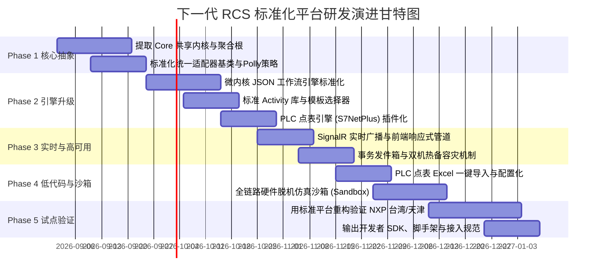

# 下一代标准化 RCS 工业级高可用平台顶层架构设计与全栈实现方案

> **文档定位**：面向工业半导体制造与智能仓储物流领域的企业级 RCS (Robot Control System) 顶层架构设计方案  
> **设计目标**：高内聚低耦合、高可用容灾、工业级标准化、插件化可插拔、低代码可配置  
> **设计角色**：高级全栈架构师 (Principal Full-Stack Architect)  
> **文档归档路径**：`/Users/feng/Documents/Code/研发/项目/RCS/05_nextgen_rcs_standard_platform_architecture.md`

---

## 一、架构设计愿景与六大核心原则

基于对 `nxp-tw-erack-rcs`、`nxp-tj`、`台湾晶技` 三大实际工业半导体项目的深度剖析与重构总结，下一代标准化 RCS 平台的设计愿景是：**构建一套“内核极简稳定、外延弹性可插拔、业务配置驱动、硬件协议全兼容、故障秒级自愈”的工业级微内核平台。**

```
┌─────────────────────────────────────────────────────────────────────────────┐
│                            六大核心架构原则                                    │
├─────────────────────────────────────────────────────────────────────────────┤
│ 1. 六边形端口与适配器架构 (Ports & Adapters): 领域核心零外部依赖，协议全面隔离     │
│ 2. 微内核 + 插件化扩展 (Microkernel & Plugins): 80%功能配置化，20%差异化插件注入│
│ 3. 声明式工作流与事件驱动 (Declarative Workflow & EDA): 告别过程式硬编码状态机  │
│ 4. 工业级高可用与零数据丢失 (HA & Zero Data Loss): 双机热备、幂等重试、事务发件箱 │
│ 5. 多厂商 AGV 兼容与 VDA 5050 标准化: 支持新松/海康/极智嘉/仙工等异构车队调度  │
│ 6. 响应式实时推送与数字孪生 (Reactive SignalR & Digital Twin): 毫秒级态势感知   │
└─────────────────────────────────────────────────────────────────────────────┘
```

---

## 二、平台总体逻辑架构全景蓝图



---

## 三、六大核心子系统设计方案

### 3.1 统一适配器框架 (Universal Adapter Framework)

#### 设计思想
将所有外部系统（AGV、MES、立库、PLC、传递窗）统一抽象为 **Port（端口契约）** 与 **Adapter（适配器实现）**。每个适配器自包含：
- **连接管理与心跳自愈**
- **Polly 弹性熔断与指数退避重试**
- **请求/响应全量报文日志与耗时追踪**
- **脱机 Mock 仿真自动切换**

#### 核心代码抽象契约
```csharp
// =========================================================================
// 1. 统一适配器生命周期基类
// =========================================================================
public interface IIndustrialAdapter : ITransientDependency
{
    string AdapterId { get; }
    string AdapterType { get; }
    Task<AdapterHealthReport> CheckHealthAsync(CancellationToken ct = default);
}

// 统一出站适配器基底（自带 Polly 熔断、日志、Mock 开关）
public abstract class OutboundIndustrialAdapter<TOptions> : IIndustrialAdapter
    where TOptions : class, IAdapterOptions, new()
{
    protected readonly TOptions Options;
    protected readonly IHttpClientFactory HttpClientFactory;
    protected readonly IInteractionLogger Logger;
    protected readonly IAsyncPolicy ResiliencePolicy;

    protected OutboundIndustrialAdapter(
        IOptions<TOptions> options,
        IHttpClientFactory httpClientFactory,
        IInteractionLogger logger)
    {
        Options = options.Value;
        HttpClientFactory = httpClientFactory;
        Logger = logger;
        ResiliencePolicy = ResiliencePolicyFactory.Create(Options);
    }

    public abstract string AdapterId { get; }
    public abstract string AdapterType { get; }

    protected async Task<TResponse> ExecuteAsync<TRequest, TResponse>(
        string operationName,
        string endpoint,
        TRequest request,
        Func<HttpClient, Task<TResponse>> realExecutor,
        Func<TRequest, Task<TResponse>> mockExecutor,
        CancellationToken ct = default)
    {
        var stopwatch = Stopwatch.StartNew();
        if (Options.UseSimulation)
        {
            var mockResult = await mockExecutor(request);
            await Logger.LogMockAsync(AdapterId, operationName, request, mockResult, stopwatch.ElapsedMilliseconds);
            return mockResult;
        }

        try
        {
            var result = await ResiliencePolicy.ExecuteAsync(async () =>
            {
                var client = HttpClientFactory.CreateClient(AdapterId);
                return await realExecutor(client);
            });

            stopwatch.Stop();
            await Logger.LogSuccessAsync(AdapterId, operationName, request, result, stopwatch.ElapsedMilliseconds);
            return result;
        }
        catch (Exception ex)
        {
            stopwatch.Stop();
            await Logger.LogErrorAsync(AdapterId, operationName, request, ex, stopwatch.ElapsedMilliseconds);
            throw new IndustrialAdapterException($"Adapter [{AdapterId}] operation [{operationName}] failed", ex);
        }
    }
}
```

---

### 3.2 声明式微内核工作流引擎 (Declarative Microkernel Workflow Engine)

#### 设计思想
- **任务状态解耦**：顶层仅保留 `Created → Running → Waiting → Succeeded → Failed → Cancelled` 6 大生命周期状态。
- **细粒度状态由步骤驱动**：细粒度业务流转全部由 JSON 工作流模板中的 `StepIndex`、`StepId`、`WaitEvent` 与 `Activity` 驱动。
- **支持挂起与事件驱动恢复**：AGV 行驶或三方动作时，工作流自动进入 `Waiting` 状态释放线程；当 TM 回调或 PLC 信号到达时，通过事件总线精确唤醒工作流。

#### 工作流模板 JSON 定义示例
```json
{
  "templateCode": "semiconductor_carrier_transfer_v1",
  "version": 1,
  "description": "半导体标准载具搬运工作流 (立库出库 -> 机台上料)",
  "steps": [
    {
      "id": "10_stocker_outbound",
      "name": "通知立库出库",
      "activity": "StockerTransferOutActivity",
      "config": { "timeoutSeconds": 60 }
    },
    {
      "id": "20_agv_dispatch",
      "name": "下发AGV调度任务",
      "activity": "TmDispatchActivity",
      "config": { "useOptionCode": true, "succession": 1 }
    },
    {
      "id": "30_wait_agv_arrive_fetch",
      "name": "等待AGV到达立库取料点",
      "wait": { "event": "AGV.Arrived", "leg": "Fetch" }
    },
    {
      "id": "40_fetch_permit_handshake",
      "name": "立库出库口安全握手放行",
      "wait": { "event": "AGV.PermitRequested", "leg": "Fetch" },
      "activity": "StockerLoadPermitActivity"
    },
    {
      "id": "50_wait_fetch_finish",
      "name": "等待AGV取料完成",
      "wait": { "event": "AGV.Finished", "leg": "Fetch" },
      "activity": "StockerReleasePortActivity"
    },
    {
      "id": "60_wait_agv_arrive_put",
      "name": "等待AGV到达机台放料点",
      "wait": { "event": "AGV.Arrived", "leg": "Put" }
    },
    {
      "id": "70_machine_plc_interlock",
      "name": "机台PLC安全连锁与放行",
      "wait": { "event": "AGV.PermitRequested", "leg": "Put" },
      "activity": "PlcMachineInterlockActivity"
    },
    {
      "id": "80_wait_put_finish",
      "name": "等待AGV放料完成",
      "wait": { "event": "AGV.Finished", "leg": "Put" },
      "activity": "PlcReleaseInterlockActivity"
    },
    {
      "id": "90_mes_completion_report",
      "name": "向MES上报任务完成",
      "activity": "MesCompletionReportActivity"
    }
  ]
}
```

---

### 3.3 工业级 PLC 点表抽象与变化事件引擎 (`PLCEngine`)

#### 设计思想
- **点表元数据驱动**：将 PLC 连接参数、DB 块号、字节偏移、位索引、数据类型通过数据库/配置文件标准化管理。
- **周期批量扫描 + 内存快照比对**：避免单点高频请求打崩 PLC。每 300ms 批量读取连续 DB 块，在内存比对变化，仅当数值变化时才发布 `PlcTagChangedEvent`。
- **库位在位绑定自动映射**：点位直接关联 `Location.Status`，实现料架在位状态的秒级自动更新。



---

### 3.4 多厂商 AGV 调度适配与 OptionCode 编译器

#### 设计思想
- **异构车队调度抽象**：上层工作流只与统一的 `IAgvFleetDriver` 交互（下发搬运、查询状态、申请放行、取消任务）。
- **向下支持多种通信协议**：
  1. **新松 TM 专有协议**（支持 OptionCode 位运算、`/{type}/api/v1/xinsong` 动态路由、RFID 校验）。
  2. **VDA 5050 国际通用标准协议**（基于 MQTT / JSON 的工业移动机器人调度标准）。
  3. **海康 / 极智嘉 / 仙工协议适配器**。

```csharp
public interface IAgvFleetDriver : IIndustrialAdapter
{
    Task<AgvDispatchResult> DispatchOrderAsync(AgvTransportOrder order, CancellationToken ct = default);
    Task<bool> CancelOrderAsync(string orderId, CancellationToken ct = default);
    Task<PermitResult> ReplyPermitAsync(string orderId, PermitDecision decision, CancellationToken ct = default);
    Task<AgvStatusDto> GetAgvTelemetryAsync(string agvId, CancellationToken ct = default);
}
```

---

### 3.5 响应式 SignalR 实时广播与前端数字孪生通道

#### 设计思想
- **服务端事件驱动广播**：工作流引擎步进、PLC 信号跳变、AGV 遥测坐标更新均发布领域事件，由 `SignalRNotifier` 统一推送到专属 Hub 频道。
- **客户端防抖节流与背压保护**：前端建立统一的 RxJS 管道，采用 `bufferTime(500)` 将高频零散事件聚合为批量更新，配合 Angular Signals 或 Vue3 ShallowRef 进行局部 DOM 刷新，杜绝卡顿与内存泄漏。

---

### 3.6 工业级高可用 (HA)、容灾与幂等机制

```mermaid
graph TB
    subgraph "HA 架构保障"
        ACTIVE["主节点 (Active Node)<br/>持有分布式租约 (Raft / Redis)"]
        STANDBY["备节点 (Standby Node)<br/>实时监听心跳"]
        DB_CLUSTER[(PostgreSQL / SQL Server HA 集群)]
    end

    CLIENT[MES / AGV / 前端] -->|虚拟 IP (VIP) / Keepalived| ACTIVE
    ACTIVE -->|状态持久化 (WAL / Transaction)| DB_CLUSTER
    ACTIVE -.->|心跳丢失 (5秒超时)| STANDBY
    STANDBY -.->|接管虚拟 IP & 锁| ACTIVE
```

1. **分布式并发锁与乐观锁版本戳**：
   - `TaskDo` 实体实现 `IHasConcurrencyStamp`，在高频回调与并发访问下防止 Step 覆盖。
2. **幂等去重指纹 (`RequestFingerprint`)**：
   - 对上层 MES/AMA 请求生成 `MD5(src + dest + materials + timestamp_window)`，防范网络重试引发的任务重复下发。
3. **事务发件箱模式 (Transactional Outbox)**：
   - 领域事件与业务实体变更在同一个数据库事务中提交，由后台 Outbox Processor 可靠投递到外部系统或消息队列，彻底避免“数据库更新成功但第三方通知失败”的数据不一致问题。
4. **断电自愈与流程断点续跑**：
   - 系统重启时，工作流引擎扫描处于 `Running` 或 `Waiting` 状态的任务，根据数据库持久化的 `StepIndex` 与 `WaitingEvent` 自动重建内存状态并继续监听，无需人工介入。

---

## 四、标准化 NuGet 模块包划分结构

为了实现极高的代码复用与插件化交付，平台拆分为以下独立的工程包：

```
Siasun.Rcs.Platform.Monorepo
├── 📦 Siasun.Rcs.Core.Shared             // 通用枚举、错误码、DTO、工具类
├── 📦 Siasun.Rcs.Core.Domain             // 任务/载具/库位聚合根、领域事件
├── 📦 Siasun.Rcs.Core.Workflow           // 微内核工作流引擎、Activity 基类、JSON解析器
├── 📦 Siasun.Rcs.Core.Application        // 通用应用服务、网关接入基类
├── 📦 Siasun.Rcs.Core.Infrastructure     // EF Core DbContext、Outbox、Polly策略
├── 📦 Siasun.Rcs.RealTime.SignalR        // SignalR Hub、事件分发通知器
│
├── 🔌 Siasun.Rcs.Adapters.Tm.Siasun      // 新松 TM 专用适配器 (HTTP + 回调 Controller)
├── 🔌 Siasun.Rcs.Adapters.Tm.Vda5050     // VDA 5050 国际标准 AGV 适配器
├── 🔌 Siasun.Rcs.Adapters.Mes.Rest       // MES 通用 REST 适配器
├── 🔌 Siasun.Rcs.Adapters.Stocker.Stkc   // 蒙莹 STKC REST 适配器
├── 🔌 Siasun.Rcs.Adapters.Stocker.Mica   // Mica SOAP/WCF 适配器
├── 🔌 Siasun.Rcs.Adapters.Plc.S7         // 西门子 S7 PLC 引擎 (S7NetPlus)
├── 🔌 Siasun.Rcs.Adapters.Passbox        // 传递窗/风淋门通用适配器
│
└── 🖥️ Siasun.Rcs.UI.Components           // 前端通用组件库 (任务看板、PLC监控、流程可视化)
```

---

## 五、基于低代码与配置驱动的项目交付模型

采用下一代平台后，新项目的交付模式将从“全量定制编码”转变为“**80% 配置化 + 20% 差异化扩展**”：

```
┌─────────────────────────────────────────────────────────────────────────────┐
│                           新项目快速交付清单                                 │
├─────────────────────────────────────────────────────────────────────────────┤
│ 1. 纯配置化交付 (Zero-Code):                                                 │
│    ├── appsettings.json: 配置启用的适配器列表 (TM, MES, Stocker, PLC)        │
│    ├── workflow_templates.json: 声明业务流程步骤与等待事件                  │
│    ├── plc_tags.xlsx: 一键导入 PLC 点表与库位在位绑定关系                    │
│    └── route_rules.json: 起始站点 ➔ 目标站点 ➔ 模板代码映射规则              │
│                                                                             │
│ 2. 少量定制扩展 (Low-Code):                                                 │
│    ├── 编写项目特有的 1~2 个 `IWorkflowActivity` (如特殊的视觉拍照复验)       │
│    └── 若对接非标老旧系统，实现一个 `IIndustrialAdapter` 插件包             │
│                                                                             │
│ 3. 平台全内置能力 (Out-of-the-Box):                                         │
│    ├── 具备 TM 回调、RFID 校验、遥测监控的完整 AGV 调度驱动                 │
│    ├── 具备断点续跑、自动重试、异常补偿的工作流引擎                          │
│    ├── 具备 500ms 缓冲的高性能 SignalR 实时监控大屏                         │
│    └── 具备全量报文审计、链路追踪与仿真沙箱的运维支撑体系                    │
└─────────────────────────────────────────────────────────────────────────────┘
```

---

## 六、演进路线与实施计划（Phase 1 ~ Phase 5）



---

## 七、总结

通过本架构方案，RCS 调度系统将彻底告别“一个项目一套代码、复制粘贴 Controller、硬编码 20+ 状态枚举、现场联调无 Mock 盲测”的历史技术债务。下一代标准化 RCS 平台将以**微内核工作流、六边形适配器、PLC 点表引擎、响应式实时推送与高可用容灾**为基石，实现半导体工业现场的高效交付与稳定运行。
