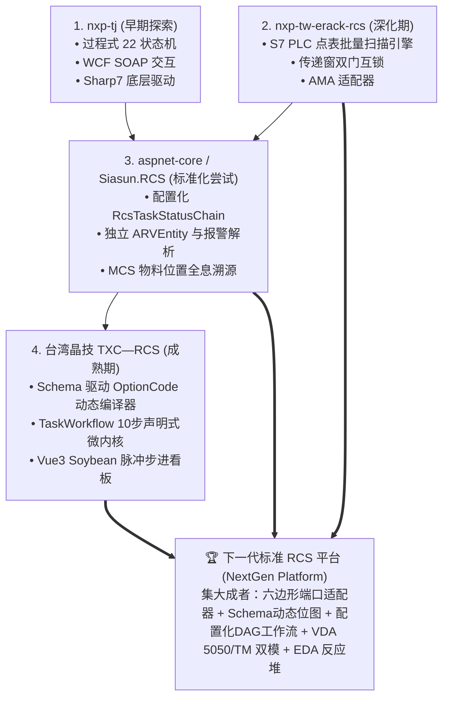

# Siasun.RCS (半导体 FOUP/FOSB 晶圆搬运 RCS) 业务需求与架构对比深度分析报告

> **项目路径**：`/Users/feng/DevOps/Projects/ZKXS/aspnet-core`  
> **工程名**：`Siasun.RCS.sln` (.NET 8 + ABP DDD 领域驱动设计框架)  
> **文档版本**：V1.0.0 Production-Ready Architecture Review  
> **文档归档路径**：`/Users/feng/Documents/Code/研发/项目/RCS/06_sandisk_murata_foup_rcs_business_spec.md`

---

## 0. 核心业务模型与需求总览（Executive Summary）

> [!IMPORTANT]
> ### 📌 一句话需求与业务闭环模型
> **本系统是面向半导体前道晶圆制造车间（Murata / SanDisk 场景）的标准 RCS 调度控制平台，负责接收上层 MCS (Material Control System) 派工（`POST /api/integration/task`）或人工建单，调度移动搬运机器人（ARV / AGV）在车间的 Sorter（分选机）、Prober（探针台）、Stocker（立库）和 Rack（电子料架）之间自动化转运 12 寸晶圆盒（FOUP / FOSB）。**  
> **系统采用基于 `appsettings.json` 配置驱动的「声明式状态链（`RcsTaskStatusChain`）」精细控制不同工艺流转（如 `S_P_Foup`, `P_S_Foup`, `S_R_Foup`, `R_S_Foup`, `P_R_Foup`, `R_P_Foup`, `S_S_Foup`, `S_P_Fosb` 等，S=Stocker, P=Prober, R=Rack），由 `RcsBackgroundWorker`（923ms 周期）自动扫描推进状态并分派新松 TM 运单；在取料完成（`PostFetchOver`）与放料完成（`PostPutOver`）时通过分布式事件总线异步上报 MCS 物料实际物理载位（`MaterialLocationReportDTO`）与任务状态（`TaskStatusReportDTO`），同时由独立 `ARVEntity` 聚合根实时监控车队状态与故障报警码。**

```
┌────────────────────────────────────────────────────────────────────────────────────────┐
│                                 全流程极简心智模型                                      │
├────────────────────────────────────────────────────────────────────────────────────────┤
│ 1. 任务接入: MCS 调用 /api/integration/task 下发晶圆搬运单 (校验 Carrier 与地址冲突)    │
│ 2. 状态链匹配: 根据 TaskType (如 S_P_Foup) 加载配置化状态链 (Init ➔ PreFetch ➔ PrePut)│
│ 3. 调度下发: RcsBackgroundWorker 扫描 Active 状态 ➔ TmAdapter 编译 OptionCode ➔ TM    │
│ 4. 同步放行: TM 触发 /api/v1/xinsong/* 回调 ➔ Pre/Post 状态跃迁 ➔ 满足条件放行机械臂  │
│ 5. 物料溯源: 离站发布 MaterialLocationChangedEvent ➔ 异步精准上报 MCS 晶圆盒所在位置 │
│ 6. 车队遥测: 独立 ARVEntity 聚合根监听车体 report_robot_status ➔ 实时解析上报故障报警 │
└────────────────────────────────────────────────────────────────────────────────────────┘
```

---

## 1. 系统模块全景与架构设计

### 1.1 项目分层架构结构

```
Siasun.RCS (aspnet-core)
├── src/
│   ├── Siasun.RCS.Domain               # 核心领域层: TaskDo, ARVEntity, ARVAlarmDescDo, 领域事件
│   ├── Siasun.RCS.Domain.Shared        # 领域共享常量、多语言资源、错误码
│   ├── Siasun.RCS.Application          # 应用服务层: RCSService, TaskService, ARVService, 状态链编排, RcsBackgroundWorker
│   ├── Siasun.RCS.Application.Contracts# DTO 契约、接口契约 (ITaskService, IARVService)
│   ├── Siasun.RCS.Adapter.TM           # 新松 TM 专用出站适配器 (TmAdapter, OptionCode 位运算, MapOptions)
│   ├── Siasun.RCS.Adapter.MCS          # 上层 MCS 专用出站适配器 (McsAdapter, 状态/物料位置/ARV上报)
│   ├── Siasun.RCS.EntityFrameworkCore  # EF Core 持久化仓储 (TaskRepository, ARVRepository, MySQL/Murata)
│   ├── Siasun.RCS.HttpApi              # Web API 控制器 (IntegrationController, TMTCController)
│   ├── Siasun.RCS.HttpApi.Host         # API 宿主入口、Swagger、appsettings.json 状态链配置
│   ├── Siasun.RCS.WebService           # SOAP WebService 兼容层 (ServiceForMcs)
│   └── Siasun.RCS.DbMigrator           # 数据库迁移控制台
```

---

## 2. 四大项目横向全方位对比矩阵

| 评估维度 | 1. NXP-TW (nxp-tw-erack-rcs) | 2. NXP-TJ (Molding_RCS) | 3. 台湾晶技 (TXC—RCS) | 4. 半导体晶圆 (aspnet-core / Siasun.RCS) |
|---|---|---|---|---|
| **业务应用场景** | 封测/烘烤/焊线/传递窗弹夹搬运 | 注塑机台/模具/立库弹夹出入库 | 石英晶体谐振器封装清洗测频 | **12寸晶圆 FOUP / FOSB 晶圆盒搬运** |
| **车间设备流向** | Erack ↔ STK ↔ WB ↔ PassBox | Mica立库 ↔ 烘箱 ↔ 注塑机 | Stocker ↔ 清洗 ↔ 封装 ↔ H099/H044 | **Stocker ↔ Sorter ↔ Prober ↔ Rack** |
| **上层调度系统** | NXP AMA (REST) | NXP AMA (REST) | MES (REST RCS-001/101) | **MCS (Material Control System)** |
| **状态机机制** | `ITaskWorkflowPolicy` 模式匹配 | `TaskStatus` 22状态过程式硬编码 | `TaskWorkflow` 10步声明式 Activity 模板 | **`RcsTaskStatusChain` JSON 配置化状态链** 🌟 |
| **消息交互模式** | 过程式直接流转 | 过程式直接流转 | 步骤挂起与异步唤醒 | **`Pre / Post` 同步握手 + 瀑布异步双模式** 🌟 |
| **OptionCode 编译** | 硬编码位运算 | 硬编码位运算 | **JSON Schema 动态动态编译器** 🏆 | `TmAdapter` 内基于 TaskType 前缀解析 |
| **车队状态建模** | 任务附带简单状态 | 任务附带简单状态 | 任务附带简单状态 | **独立 `ARVEntity` 聚合根 + 故障码字典库** 🌟 |
| **物料在位溯源** | 离架上报 CARRIER_RELOCATION | 本地 Plan 状态跟踪 | 完工上报 MES | **`MaterialLocationChangedApplicationEto`** (精确跟踪在车/在站) 🌟 |
| **并发与冲突检查** | 任务指纹 SHA-256 去重 | 库位预先锁定 | 幂等比对 + 字段差异描述 | **`AnyAsync` 实时排查 Carrier 与起终点地址冲突** |
| **前端技术栈** | Vue 3 (Soybean) | Vue 3 + React 双栈 | **Vue 3 (Soybean) + 10步脉冲图** 🏆 | (仅后端核心框架，无专用前端项目) |

---

## 3. `aspnet-core (Siasun.RCS)` 的架构亮点与独到设计

### 3.1 亮点一：配置化「状态链」与 Pre/Post 双消息模式 (`RcsTaskStatusChain`)
该项目在 `appsettings.json` 中配置了每一种搬运业务类型（如 `S_P_Foup`、`P_S_Foup`、`S_R_Foup` 等）的执行状态链：
- **`Pre` 前缀（同步消息模式）**：如 `PreFetch`，代表 AGV 发起动作申请，RCS 收到后检查前置条件，允许则跃迁为 `PostFetch` 予以放行；
- **`Post` 前缀（异步瀑布模式）**：如 `PostFetchOver`，代表 AGV 动作已完成，RCS 自动推进物料流转。
- **优势**：新增一种物料搬运路线或工段流转，**无需改动 C# 状态机代码，只需在配置文件新增一段 `RcsTaskStatusChain`**！

### 3.2 亮点二：物料流转生命周期全息溯源 (`MaterialLocationChanged`)
在晶圆制造前道中，上层 MCS 极度关注 12 寸高价值晶圆盒当前“到底在机台、在立库、还是在 AGV 车身上面”：
- 当任务状态推进至 `PostFetchOver` 时，发布事件将物料位置更新为 `AGV_Id`（在车上移动）；
- 当任务推进至 `PostPutOver` 时，发布事件将物料位置更新为 `ToAddr`（已入站）；
- 通过 `McsAdapter.ReportMaterialLocation` 实时向 MCS 同步，保证了物理世界与 MES 孪生世界的高度一致。

### 3.3 亮点三：独立的 `ARVEntity` 车队聚合根与报警解析
与前三个项目“把 AGV 仅视为一个 ID 字符串”不同，本项目在领域层建立了完整的 `ARVEntity` 实体：
- 记录 `Status`（运行/空闲/充电/离线）与 `ArvAlarm`（报警代码）；
- 状态发生变化时自动触发 `ARVStatusAlarmChangedDomainEvent`；
- 通过 `ARVAlarmDescDo` 字典表将冰冷的十六进制故障码（如 `B0LP010004`）自动翻译为人类可读的中文报警描述，并上报给 MCS。

---

## 4. `aspnet-core (Siasun.RCS)` 存在的不足与重构空间

1. **OptionCode 仍存在硬编码解析**：
   - 在 `TmAdapter.cs` 中，`TaskCode1` 和 `TaskCode2` 依然通过 `task.TaskType.Contains("Foup") ? 1 : 2` 和 `task.TaskType.Substring(0, 2)` 硬切字符串，没有使用像 `TXC—RCS` 那样的 JSON Schema 动态编译器。
2. **缺乏可视化工作流编排器**：
   - 虽然状态链已经做到了 `appsettings.json` 配置化，但其逻辑依然是单向线性数组（`StatusChain`），不支持分支判断（Condition Fork）、并行（Fork-Join）和步骤超时重试。
3. **前端展示缺失**：
   - 该仓库仅包含后端 .NET 8 WebApi，缺少类似 `TXC—RCS` 的高颜值 Soybean Admin 监控大屏。

---

## 5. 架构演进全景：四大项目的血缘关系与下一代标准平台定位

从代码风格、命名规范（Zhang Zhenhua）、ABP DDD 结构和 TM 通信协议可以看出这 4 个项目的演进脉络：



**结论**：`aspnet-core` 是团队在将 RCS 调度框架**从专用项目向通用半导体标准化产品演进**的重要里程碑，其配置化状态链、ARV 状态聚合根与物料全息溯源设计非常优秀，完全契合并应被完整吸收到我们的 **下一代标准化 RCS 平台** 中！
