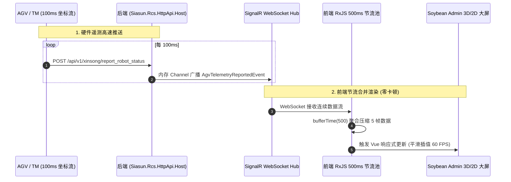

# 标准化 RCS 调度平台全模块功能清单与前后端架构工程落地规范

> **基线源码库**：`/Users/feng/DevOps/Projects/ZKXS`（全量项目：`nxp-tw-erack-rcs`, `nxp-tj`, `台湾晶技/TXC—RCS`, `aspnet-core`, `SanDisk`）  
> **技术选型基线**：  
> • **后端**：.NET 8/9 + ABP Framework 纯净 Web API 模板（DDD 领域驱动设计 / 微内核架构）  
> • **前端**：Soybean Admin (Vue 3 + TypeScript + Naive UI + UnoCSS + Vite + Pinia)  
> **文档定位**：0-to-1 研发全景工程规范与功能字典  
> **文档归档路径**：`/Users/feng/Documents/Code/研发/项目/RCS/07_standard_rcs_platform_full_modular_specification.md`

---

## 目录
1. **三大工段业务全景与真实代码实体映射**
2. **全平台 8 大业务模块与 42 项精细功能点全景表格（代码级对照）**
3. **后端 ABP 纯净 Web API 架构工程目录与核心类全景**
4. **前端 Soybean Admin (Vue 3 + Naive UI) 改造目录与视图组件全景**
5. **前后端交互协议与高性能数据管道规范**

---

# 一、四大工段真实业务流与代码实体全息映射

基于对 ZKXS 目录下全部源码的深度剖析，提取出现场 4 大核心业务流转模式：

```mermaid
flowchart TB
    subgraph S1["工段 1：半导体封测 / 焊线流转 (NXP-TW)"]
        TW_ERACK["DB-Erack 智能料架<br/>(S7-1200 DB800 46B)"] -->|1. Fetch/Put| TW_STK["WB-E-Stocker (STKC REST)"]
        TW_STK -->|2. 上料/回库| TW_WB["Wire Bonder 焊线机台群"]
        TW_STK -->|3. 跨洁净区| TW_WIN["EPass 传递窗 (晖哲 8接口)"]
    end

    subgraph S2["工段 2：注塑成型与重模具仓储 (NXP-TJ)"]
        TJ_STK["Mica 自动化立库<br/>(WCF SOAP NetHttp)"] -->|1. StockOut 齐套| TJ_MOLD["注塑机台 (SP170 / BMD)<br/>(S7-1500 DB100 硬件防撞)"]
        TJ_MOLD -->|2. StockIn 回库| TJ_STK
    end

    subgraph S3["工段 3：石英晶体谐振器封装测频 (TXC)"]
        TXC_STK["ASRS 立库 / Rack"] -->|1. 派工 RCS-001| TXC_CLEAN["清洗机台"]
        TXC_CLEAN -->|2. 搬运| TXC_SEAL["真空封装机台"]
        TXC_SEAL -->|3. 搬运| TXC_TEST["H099 / H044 测频机台"]
        TXC_TEST -->|4. 完工 RCS-101| TXC_STK
    end

    subgraph S4["工段 4：12寸晶圆前道转运 (aspnet-core / SanDisk)"]
        SD_STK["Stocker 晶圆立库"] -->|1. S_P_Foup| SD_PROBER["Prober 探针台 / Sorter 分选机"]
        SD_PROBER -->|2. P_R_Foup| SD_RACK["Rack 电子料架"]
    end
```



---

# 二、全平台 8 大业务模块与 42 项精细功能点全景表

| 模块编号 | 模块名称 | 功能点编号 | 功能点名称 | 对应 ZKXS 源码位置 / 真实代码依据 | 业务逻辑与输入输出详细说明 | 归属分类 |
|:---|:---|:---|:---|:---|:---|:---|
| **M01** | **任务调度编排** | **F1.1** | 请求指纹排重 | `RequestFingerprintGenerator.cs` (`nxp-tw`) | 基于 `SHA256(TaskType\|Src\|Dest\|Carrier\|Lot)` 查重，拦截 1s 内重复建单并返回 `50001`。 | **【通用核心】** |
| | | **F1.2** | 声明式 DAG 引擎 | `TaskWorkflow.cs`, `WorkflowTemplateCatalog.cs` (`TXC`) | 采用 10 步微内核替代 switch-case，管理 `Wait.Event` 挂起与 `SignalAsync` 异步唤醒。 | **【通用核心】** |
| | | **F1.3** | 乱序与重复信号容错 | `TaskWorkflow.WasAlreadyConsumed` (`TXC`) | 当 TM 重复发送或网络延迟到达已知步骤时，幂等回放响应，不推进步骤计数。 | **【通用核心】** |
| | | **F1.4** | SAGA 四级逆向回滚 | `TaskCancelOrchestrator.cs` (`nxp-tj`, `nxp-tw`) | 发生故障取消时按序触发：1.TM撤单 ➔ 2.三方设备取消 ➔ 3.解锁库位 ➔ 4.上报MES。 | **【通用核心】** |
| | | **F1.5** | 多车批次门禁过滤器 | `BatchHandshakeGate.cs` (`nxp-tw`) | 同批任务仅首车触发立库/传递窗开门（`LOADREQ`），同批全部完成仅末车触发关门（`LOADCOMPLETED`）。 | **【通用核心】** |
| | | **F1.6** | 动态改点与分流 | `POST /task_arrive_target_pre` (`SanDisk 2026 PDF`) | AGV 预到达前上报，系统动态计算空闲立库口，返回更新后的 `port`, `target`, `option_code`。 | **【通用核心】** |
| | | **F1.7** | 任务优先级动态重排 | `POST /task_priority` (`SanDisk 2026 PDF`) | 允许 MES 动态插入紧急单，调用 TM 接口调整在途运单权重 (1~100)。 | **【通用核心】** |
| **M02** | **库位物料全息** | **F2.1** | 动态库位状态机 | `StationPoint.cs`, `tb_location` (`nxp-tw`, `TXC`) | 管理 `Empty(2)`, `Occupied(1)`, `Reserved(3)`, `Disabled(4)`, `Warn(5)` 原子锁。 | **【通用核心】** |
| | | **F2.2** | 物料在位全息溯源 | `MaterialLocationChangedApplicationEto` (`aspnet-core`) | 取货完工上报物料转移至 `AGV_Id`（在途），放货完工上报转移至 `ToAddr`（在站）。 | **【通用核心】** |
| | | **F2.3** | 传感器白名单比对 | `LocationStatusSyncer.cs` (`nxp-tw`) | 比对 PLC 传感器与系统库位，允许 `Sys=Reserved & Plc=Occupied` 的合法过渡态，突变报警。 | **【通用核心】** |
| | | **F2.4** | S7 内存 46B 槽位映射 | `DB800` 偏移公式 (`nxp-tw`) | `Offset = Base + [(C-1)*M*K + (L-1)*K + (S-1)] * 46`，解析在位码与 TrackingCode。 | **【通用核心】** |
| | | **F2.5** | 冲突实时防重校验 | `TaskService.CreateAsync` (`aspnet-core`) | `AnyAsync(x => x.ContainerId == input && !Cancelled)` 强校验 Carrier 与起终点占用。 | **【通用核心】** |
| **M03** | **车队交通协同** | **F3.1** | 车辆智能指派器 | `VehicleAssigner.cs`, `AgvFleetRouter.cs` | 根据距离、电量、车型（机械臂/潜伏式叉车）与物料属性（Foup/Fosb）自动分配最优车辆。 | **【通用核心】** |
| | | **F3.2** | 物理干涉区互锁防撞 | `DB100.DBX0.3 (AGV_In_Zone)` (`nxp-tj`) | 机械臂伸入机台前置位 PLC 干涉锁，机台锁定合模与安全门；离开后复位。 | **【通用核心】** |
| | | **F3.3** | 车体聚合根全息管理 | `ARVEntity.cs`, `rcs_tb_arv` (`aspnet-core`) | 维护车队独立聚合根，实时记录 `Status`、`Battery`、`Velocity`、`Odom`。 | **【通用核心】** |
| | | **F3.4** | 故障码自动翻译字典 | `ARVAlarmDescDo.cs` (`aspnet-core`) | 将底层十六进制故障码（如 `B0LP010004`）自动关联为中文描述上报给上层。 | **【通用核心】** |
| | | **F3.5** | 安全激光雷达屏蔽 | `DB100.DBX0.2 (Curtain_Muted)` (`nxp-tj`) | 进入机台前置 1 屏蔽安全光栅急停触发，动作完成后置 0 恢复防护。 | **【通用核心】** |
| **M04** | **工装治具控制** | **F4.1** | Schema 动态位图编译 | `OptionCodeEncoder.cs`, `txc_demo.v1.json` (`TXC`) | 基于 JSON Schema 动态解析 `master`/`port`/`leg`/`const` 数据源，拼装 32 位二进制码。 | **【通用核心】** |
| | | **F4.2** | 操作码快照固化 | `FreezeOptionCodes()` (`TXC`) | 任务创建时计算 OptionCode 并冻结至任务实体，放行时直接回放，杜绝主数据漂移。 | **【通用核心】** |
| | | **F4.3** | 手眼视觉与 RFID 校验 | `POST /check_cargo_rfid` (`SanDisk 2026 PDF`, `aspnet-core`) | 车载机械臂读取 RFID，RCS 比对 `task.ContainerId` 并返回 `check_code: 1(OK)/2(NG)`。 | **【通用核心】** |
| | | **F4.4** | 6轴运动学到位确认 | `robot_permiss_start_action` (`nxp-tw`, `TXC`, `nxp-tj`) | 收到申请放行回调后，校验前置安全联锁，回填 `option_code` 启动车载动作。 | **【通用核心】** |
| **M05** | **上下游集成网关** | **F5.1** | MES 入站派工 (RCS-001)| `POST /api/v1/mes/Public_Job_Created` (`TXC`) | 接收 1~2 条绑定任务，执行原子校验、`MatchesMesDispatch` 幂等与差异描述。 | **【项目适配】** |
| | | **F5.2** | MES 出站完工 (RCS-101)| `POST /Job_Finish_Report` (`TXC`) | 订阅 `TaskLifecycleEndedEvent`，成功(1)/取消(2)上报，失败静默不上报。 | **【项目适配】** |
| | | **F5.3** | AMA 搬运调度接口 | `REQ.MHS.MATERIAL_TRANSPORT_REQUEST` (`nxp-tw`, `nxp-tj`) | 接收 AMA 批量任务、上报 `TRANSPORT_NOTIFICATION` 与 `CARRIER_RELOCATION`。 | **【项目适配】** |
| | | **F5.4** | 蒙莹 STKC 6 接口适配 | `StkcIntegrationService.cs` (`nxp-tw`) | 实现 `/reserve`, `/exist`, `/transfer/out`, `/arv/request`, `/arv/completed`, `/cancel`。 | **【通用适配】** |
| | | **F5.5** | 晖哲传递窗 8 接口适配 | `WinIntegrationService.cs` (`nxp-tw`) | 实现左门入料、风淋吹淋状态机、右门出料与状态查询。 | **【通用适配】** |
| | | **F5.6** | Mica WMS SOAP 适配 | `ServiceWmsChannelFactory.cs` (`nxp-tj`) | NetHttp + BinaryMessageEncoding WCF 协议客户端，管理 24 个 SOAP 契约方法。 | **【通用适配】** |
| | | **F5.7** | Transactional Outbox | `OutboxDispatcherWorker.cs` (`Siasun.Platform`) | 本地事务写发件箱 + Polly 指数退避后台重试，确保 MES 通知 100% 投递。 | **【通用核心】** |
| **M06** | **3D/2D 数字孪生** | **F6.1** | Three.js 3D 设备孪生 | `robot_station_3d.html` | 3D 渲染机台、机械臂 J1~J6 实时姿态、夹爪、料盒在位与激光雷达扇形光束。 | **【通用核心】** |
| | | **F6.2** | 2D 拓扑车队轨迹监控 | `2d-topology-map.vue` | 渲染车间拓扑路径、AGV 实时位置坐标与站点热力图。 | **【通用核心】** |
| | | **F6.3** | RxJS 500ms 节流管道 | `useTelemetryThrottle.ts` | 针对 100ms 高频坐标流进行前端缓冲聚合，保证 60 FPS 流畅不卡顿。 | **【通用核心】** |
| | | **F6.4** | 10 步脉冲任务看板 | `TaskMonitorStepper.vue` (`TXC`) | 实时展示任务执行的 10 步节点，脉冲呼吸灯高亮当前正在执行的物理动作。 | **【通用核心】** |
| **M07** | **低代码与设计器** | **F7.1** | 可视化 DAG 流程设计器 | `workflow/index.vue` (Vue Flow / X6) | 拖拽节点配置工序（Fetch ➔ Put ➔ Interlock ➔ Permit），生成流程模板。 | **【通用核心】** |
| | | **F7.2** | Schema 位图可视化配置 | `schema/index.vue` (`TXC`) | 可视化配置 32 位二进制操作码字段、位宽、数据源与枚举。 | **【通用核心】** |
| | | **F7.3** | PLC 点表 Excel 动态导入 | `plc-import/index.vue` (`nxp-tw`) | 一键上传现场 Excel 点表并自动与系统库位建立 S7 地址映射。 | **【通用核心】** |
| **M08** | **审计与仿真沙箱** | **F8.1** | 全量报文拦截审计 | `ThirdPartyCallLog.cs`, `TaskInteractionLog.cs` | 自动抓取并记录所有出入站 HTTP/SOAP 报文、耗时、状态码与 TraceId。 | **【通用核心】** |
| | | **F8.2** | 硬件脱机仿真沙箱 | `SimulationTmClient.cs`, `SimulationMesReporter.cs` (`TXC`) | 启动内置 Mock 车辆与设备，无需现场硬件即可完成 100% 端到端业务验证。 | **【通用核心】** |

---

# 三、后端 ABP 纯净 Web API 标准目录结构与代码组织

后端采用 **.NET 8 / 9 + 纯净 ABP Web API 模板**（无多余 MVC 页面），划分为 **01.Core（发布 NuGet）、02.Application、03.Adapters（发布 NuGet）、04.Infrastructure、05.HttpApi、06.Hosting**：

```text
Siasun.Rcs.Backend/
├── common.props                                      # 全局统一编译配置与版本号 (net8.0, Nullable=enable)
├── Siasun.Rcs.sln                                    # 解决方案文件
│
├── src/
│   ├── 01.Core/                                      # ───【纯净领域与微内核（可独立发布 NuGet 包）】───
│   │   ├── Siasun.Rcs.Core.Domain/                   # 纯净领域层
│   │   │   ├── Entities/                             # TaskDo.cs, ARVEntity.cs, StationPoint.cs, Carrier.cs
│   │   │   ├── Events/                               # 领域事件: TaskLifecycleEndedEvent, PlcTagChangedEvent
│   │   │   ├── Ports/                                # 核心出站端口接口: IAgvFleetDriver.cs, IStockerAdapter.cs, IPlcReader.cs
│   │   │   └── SiasunRcsCoreDomainModule.cs
│   │   │
│   │   ├── Siasun.Rcs.Core.Workflow/                 # 声明式 DAG 工作流引擎 (发布 NuGet 包)
│   │   │   ├── Engine/                               # WorkflowEngine.cs, ActivityContext.cs, TaskWorkflow.cs
│   │   │   ├── Templates/                            # WorkflowTemplateCatalog.cs, StandardFetchPutWorkflow.cs
│   │   │   ├── Saga/                                 # SagaCompensator.cs (四级逆向补偿)
│   │   │   └── SiasunRcsCoreWorkflowModule.cs
│   │   │
│   │   └── Siasun.Rcs.Core.Schema/                   # 32位 OptionCode 动态位图编译器 (发布 NuGet 包)
│   │       ├── Compilers/                            # OptionCodeCompiler.cs, OptionCodeAssembler.cs, LsbBitEncoder.cs
│   │       ├── Models/                               # OptionCodeSchemaDefinition.cs, SchemaField.cs
│   │       └── SiasunRcsCoreSchemaModule.cs
│   │
│   ├── 02.Application/                               # ───【应用服务层】───
│   │   ├── Siasun.Rcs.Application.Contracts/         # DTO 与接口契约 (ITaskAppService, ILocationAppService)
│   │   └── Siasun.Rcs.Application/                   # 业务编排服务
│   │       ├── Tasks/                                # TaskAppService.cs, BatchReleaseGate.cs, RequestFingerprintService.cs
│   │       ├── Locations/                            # LocationAppService.cs, LocationStatusSyncer.cs (白名单比对)
│   │       ├── Fleet/                                # FleetAppService.cs, ArvAlarmDecoderService.cs
│   │       └── SiasunRcsApplicationModule.cs
│   │
│   ├── 03.Adapters/                                  # ───【硬件与三方协议适配器（可独立发布 NuGet 包）】───
│   │   ├── Siasun.Rcs.Adapters.Tm/                   # 新松 TM (12端点全覆盖) + VDA 5050 统一驱动 (发布 NuGet 包)
│   │   │   ├── Drivers/                              # SiasunTmDriver.cs, Vda5050MqttDriver.cs, DynamicFleetRouter.cs
│   │   │   ├── Models/                               # TmTaskDto.cs, Vda5050Order.cs, TmCallbackDtos.cs
│   │   │   └── SiasunRcsTmAdapterModule.cs
│   │   │
│   │   ├── Siasun.Rcs.Adapters.Plc.S7/               # 西门子 S7 批量扫描与缓存引擎 (发布 NuGet 包)
│   │   │   ├── Drivers/                              # S7NetPlusBlockReader.cs, InMemoryTagValueCache.cs, PlcBatchScanWorker.cs
│   │   │   └── SiasunRcsS7PlcModule.cs
│   │   │
│   │   ├── Siasun.Rcs.Adapters.Stocker/              # 立库适配器 (内置 STKC REST 与 Mica WCF SOAP)
│   │   │   ├── Stkc/                                 # StkcRestAdapter.cs
│   │   │   ├── Mica/                                 # MicaSoapWcfAdapter.cs, ServiceWmsChannelFactory.cs
│   │   │   └── SiasunRcsStockerAdapterModule.cs
│   │   │
│   │   └── Siasun.Rcs.Adapters.Passbox/              # 晖哲双门互锁风淋传递窗适配器
│   │       ├── HuizhePassboxAdapter.cs
│   │       └── SiasunRcsPassboxAdapterModule.cs
│   │
│   ├── 04.Infrastructure/                            # ───【持久化与中间件】───
│   │   ├── Siasun.Rcs.EntityFrameworkCore/           # EF Core (PostgreSQL / MySQL 仓储实现)
│   │   ├── Siasun.Rcs.Infrastructure.Audit/          # 全量 HTTP/SOAP 报文拦截器 + Outbox 事务发件箱
│   │   │   ├── Interceptors/                         # LoggingDelegatingHandler.cs, ThirdPartyAuditLogger.cs
│   │   │   ├── Outbox/                               # OutboxMessage.cs, OutboxDispatcherWorker.cs (Polly重试)
│   │   │   └── SiasunRcsInfrastructureAuditModule.cs
│   │   │
│   │   └── Siasun.Rcs.Infrastructure.Realtime/       # SignalR 实时广播通道
│   │       ├── Hubs/                                 # RcsTelemetryHub.cs, RcsTaskEventHub.cs
│   │       └── SiasunRcsRealtimeModule.cs
│   │
│   ├── 05.HttpApi/                                   # ───【RESTful 控制器层】───
│   │   └── Siasun.Rcs.HttpApi/                       # 供前端与外部调用的纯 API 控制器
│   │       ├── Controllers/                          # MesJobController.cs, TmCallbackController.cs, TaskController.cs
│   │       └── SiasunRcsHttpApiModule.cs
│   │
│   └── 06.Hosting/                                   # ───【可执行 Web API 宿主程序】───
│       └── Siasun.Rcs.HttpApi.Host/                  # 纯净 API 宿主
│           ├── appsettings.json                      # 数据库连接、驱动参数与基础配置
│           ├── Program.cs                            # 30行极简启动入口
│           └── SiasunRcsHttpApiHostModule.cs         # ABP 根依赖装配模块
```

---

# 四、前端 Soybean Admin (Vue 3 + Naive UI) 规范改造目录结构

前端基于 **Soybean Admin** 改造，针对工业 RCS 场景增加了 **Three.js 3D 数字孪生、10 步脉冲看板、DAG 工作流设计器与 OptionCode 可视化逆向解析**：

```text
Siasun.Rcs.Web/ (基于 Soybean Admin 改造)
├── build/                                            # Vite 构建插件配置
├── public/                                           # 静态模型与 CAD 资产 (.gltf / .hdr / 纹理)
│   └── models/                                       # robot_station.gltf, agv_chassis.gltf
│
├── src/
│   ├── api/                                          # ───【后端强类型接口对接】───
│   │   ├── task.ts                                   # 任务列表、创建、取消、重新派发 API
│   │   ├── fleet.ts                                  # 车辆状态、坐标、急停恢复、手动遥控 API
│   │   ├── location.ts                               # 库位状态、Erack 料架矩阵、PLC 传感器数据 API
│   │   ├── designer.ts                               # DAG 流程模板保存、OptionCode Schema 配置 API
│   │   └── audit.ts                                  # 全链路报文追踪与日志查询 API
│   │
│   ├── views/                                        # ───【业务视图模块】───
│   │   ├── dashboard/                                # 1. 监控与态势大屏
│   │   │   ├── index.vue                             # 大屏总览主页
│   │   │   └── modules/
│   │   │       ├── 3d-digital-twin.vue               # 【核心】Three.js 机械臂/工装 3D 数字孪生看板
│   │   │       ├── 2d-topology-map.vue               # 2D 站点与 AGV 运行热力图
│   │   │       └── kpi-metric-cards.vue              # 节拍、完成率、OEE 统计卡片
│   │   │
│   │   ├── task/                                     # 2. 任务调度管理
│   │   │   ├── index.vue                             # 任务看板列表（支持自动轮询与实时推送）
│   │   │   └── modules/
│   │   │       ├── task-monitor-modal.vue            # 任务执行监控抽屉（概要/日志/报文）
│   │   │       ├── task-monitor-stepper.vue          # 【核心】10 步脉冲状态步进图 (物理动作动态高亮)
│   │   │       └── task-create-modal.vue             # 人工建单与干跑校验弹窗
│   │   │
│   │   ├── fleet/                                    # 3. 移动机器人车队管理
│   │   │   ├── index.vue                             # 车辆实时列表（电量、坐标、状态）
│   │   │   └── modules/
│   │   │       ├── vehicle-alarm-drawer.vue          # 故障码中文诊断与故障历史抽屉
│   │   │       └── vehicle-teleop-modal.vue          # 手动示教与紧急停止控制弹窗
│   │   │
│   │   ├── location/                                 # 4. 库位与料架管理
│   │   │   ├── index.vue                             # 库位状态总览表格
│   │   │   └── modules/
│   │   │       ├── erack-matrix-viewer.vue           # 电子料架层/列/槽位网格矩阵可视化
│   │   │       └── plc-sensor-sync-table.vue         # PLC 物理在位 vs 数据库比对白名单视图
│   │   │
│   │   ├── designer/                                 # 5. 低代码设计器中心
│   │   │   ├── workflow/                             # 【核心】DAG 工作流可视化设计器 (Vue Flow / X6)
│   │   │   │   └── index.vue                         # 拖拽式定义搬运工序步骤与分支
│   │   │   ├── schema/                               # 【核心】OptionCode 32 位位图可视化设计器
│   │   │   │   └── index.vue                         # 可视化配置位宽、偏移与数据源
│   │   │   └── plc-import/                           # PLC 点表 Excel 解析导入器
│   │   │
│   │   └── system/audit/                             # 6. 系统审计与日志追踪
│   │       ├── index.vue                             # HTTP / SOAP 全量报文拦截审计台
│   │       └── modules/
│   │           └── trace-timeline-modal.vue          # 单任务端到端分布式 Trace 链路时序图
│   │
│   ├── composables/                                  # ───【高复用组合式函数 (Hooks)】───
│   │   ├── use-three-scene.ts                        # Three.js 场景初始化、光影、渲染循环 Hook
│   │   ├── use-signalr.ts                            # SignalR WebSocket 连接管理与自动重连 Hook
│   │   ├── use-telemetry-throttle.ts                 # 【核心】RxJS 500ms 坐标流批量节流处理 Hook
│   │   ├── use-master-field-meta.ts                  # OptionCode 逆向解析字典映射 Hook
│   │   └── use-option-code-decoder.ts                # 32 位 OptionCode 字段拆解器
│   │
│   ├── store/modules/                                # ───【Pinia 状态管理】───
│   │   ├── task.ts                                   # 运行中任务状态缓存
│   │   ├── fleet.ts                                  # AGV 实时坐标与车队在线状态缓存
│   │   └── socket.ts                                 # WebSocket 实时通信状态
│   │
│   └── plugins/                                      # Naive UI、UnoCSS、图标等插件配置
```

---

# 五、前后端高性能数据管道设计（动静分离）



1. **业务控制走标准 RESTful API**：建单、取消、任务列表、低代码设计器走 HTTP REST 接口；
2. **高频遥测走 SignalR + RxJS**：小车坐标、雷达扫描、机械臂关节角度走 WebSocket 推送，前端经 `bufferTime(500)` 节流合并后直接驱动 Three.js 3D 模型平滑渲染，**彻底解决页面卡顿与数据库性能崩溃问题**！
