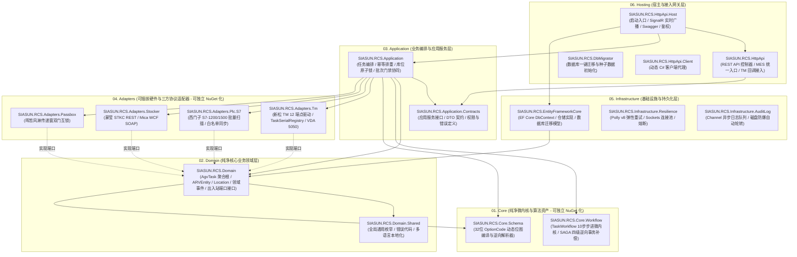

# SIASUN RCS 3.0 后端架构与工程目录分层规范

> **系统定位**：标准化企业级机器人调度控制系统（Robot Control System 3.0）后端核心  
> **核心原则**：微内核驱动、六边形端口隔离（Ports & Adapters）、高内聚低耦合、80% 标准资产固化 + 20% 差异化插件注入

---

## 📑 目录
1. [系统总体逻辑架构图](#一系统总体逻辑架构图)
2. [工程目录组织与职责全景（什么地方放置什么内容）](#二工程目录组织与职责全景)
3. [各分层核心代码规范与放置示例](#三各分层核心代码规范与放置示例)
4. [7 大核心架构约束红线](#四7-大核心架构约束红线)
5. [常用命令与开发工作流](#五常用命令与开发工作流)

---

# 一、系统总体逻辑架构图



---

# 二、工程目录组织与职责全景（什么地方放置什么内容）

本解决方案按 **六大主功能层** 进行严格分类管理：

| 目录层级 | 工程名称 | 职责说明 | 建议放置内容 |
| :--- | :--- | :--- | :--- |
| **`01.Core/`** | `SIASUN.RCS.Core.Schema` | 纯算力工具与位图编译器 | JSON Schema 解析器、32 位二进制拼装/逆向反解算法、字段编码器（LSB/MSB）。**严禁依赖数据库或业务实体**。 |
| | `SIASUN.RCS.Core.Workflow` | 声明式通用步进工作流微内核 | 10 步标准化搬运工序微内核、Activity 节点定义、`Suspend`/`SignalAsync` 异步唤醒引擎、SAGA 四级逆向事务补偿器。 |
| **`02.Domain/`** | `SIASUN.RCS.Domain.Shared` | 领域共享元数据 | 任务状态（`Pending`, `Running`, `Succeeded`, `Failed`, `Canceled`）、物料类型、报警枚举、错误码、多语言 JSON。 |
| | `SIASUN.RCS.Domain` | 纯净业务领域层（六边形核心） | 核心实体（`AgvTask`, `Carrier`, `LocationPoint`, `ARVEntity`, `TaskSerialRegistry`）、领域事件、仓储接口、**出入站端口接口契约（`IAgvFleetDriver`, `IPlcHardwareGate`, `IStockerAdapter`）**。 |
| **`03.Application/`** | `SIASUN.RCS.Application.Contracts` | 应用服务契约与 DTO | 外部入参 DTO、返回 DTO、应用服务接口（`ITaskAppService`, `ILocationAppService`）、权限与策略定义。 |
| | `SIASUN.RCS.Application` | 业务编排与用例实现 | 任务指纹防重、任务创建与生命周期调度、库位 5 态原子锁管理、多车同批次门禁过滤器（`BatchHandshakeGate`）、领域事件订阅处理。 |
| **`04.Adapters/`** | `SIASUN.RCS.Adapters.Tm` | 新松 TM / VDA 5050 适配器 | 新松 TM 12 端点驱动实现、通配回调网关解析、`TaskSerialRegistry` 映射绑定、VDA 5050 MQTT 驱动。 |
| | `SIASUN.RCS.Adapters.Plc.S7` | 西门子 S7 工业 PLC 适配器 | S7.Net 批量读取 Worker、46B 槽位偏移计算、内存标签缓存、光电传感器状态白名单比对。 |
| | `SIASUN.RCS.Adapters.Stocker` | 智能立体库适配器 | 蒙莹 STKC 6 个 REST 接口适配、Mica WMS 24 个 WCF SOAP 接口封装。 |
| | `SIASUN.RCS.Adapters.Passbox` | 洁净区传递窗适配器 | 晖哲 8 接口双门互锁状态机适配。 |
| **`05.Infrastructure/`**| `SIASUN.RCS.EntityFrameworkCore` | 关系型数据库持久化 | EF Core DbContext、实体属性映射 Fluent API、SQL Server/PostgreSQL 仓储实现、数据库迁移记录。 |
| | `SIASUN.RCS.Infrastructure.Resilience` | 工业级通信底座 | 基于 `SocketsHttpHandler` + Polly v8 弹性策略（超时、指数抖动重试、熔断）的通用执行器。 |
| | `SIASUN.RCS.Infrastructure.AuditLog` | 全链路黑匣子审计 | System.Threading.Channels 异步无阻塞日志队列、全量出入站报文持久化、工控机磁盘防爆自动轮转。 |
| **`06.Hosting/`** | `SIASUN.RCS.HttpApi` | REST API 控制器层 | MES 派工控制器、TM 回调接收端点、外部交互 Web API。 |
| | `SIASUN.RCS.HttpApi.Host` | 主宿主程序 | ASP.NET Core 启动配置、中间件管道、SignalR 广播 Hub、OpenIddict 认证鉴权、Swagger。 |
| | `SIASUN.RCS.DbMigrator` | 数据库迁移控制台 | 生产环境独立执行数据库迁移与种子数据填充的工具。 |
| **`test/`** | `SIASUN.RCS.*.Tests` | 单元与集成测试 | 针对 Domain、Application、EFCore、Schema 编译器的自动化测试套件与 Mock 沙箱。 |

---

# 三、各分层核心代码规范与放置示例

### 1. 领域模型放置规则 (`02.Domain/SIASUN.RCS.Domain`)
```text
02.Domain/SIASUN.RCS.Domain/
├── Tasks/
│   ├── AgvTask.cs                      # 任务聚合根（仅暴露 5 态生命周期）
│   ├── AgvTaskStep.cs                  # 细粒度步骤实体
│   ├── TaskSerialRegistry.cs           # TM 序号与内部任务映射注册实体
│   └── Events/                         # TaskLifecycleEndedEvent.cs 等领域事件
├── Locations/
│   ├── LocationPoint.cs                # 库位聚合根（5 态原子锁）
│   └── Carrier.cs                      # 载具物料实体（全息追溯）
├── Fleet/
│   ├── ARVEntity.cs                    # 车辆状态聚合根
│   └── ARVAlarmDesc.cs                 # 报警字典实体
└── Ports/                              # ─── 六边形出站端口接口（核心防腐隔离）───
    ├── IAgvFleetDriver.cs              # TM 车队调度接口
    ├── IPlcHardwareGate.cs             # PLC 硬件安全门禁与互锁接口
    └── IStockerAdapter.cs              # 立库适配接口
```

### 2. 纯算法与微内核放置规则 (`01.Core`)
```text
01.Core/
├── SIASUN.RCS.Core.Schema/
│   ├── Compiler/
│   │   ├── OptionCodeCompiler.cs       # 32 位位图编译器核心
│   │   └── OptionCodeAssembler.cs      # 动态位装配器
│   └── Models/
│       ├── OptionCodeSchemaDefinition.cs # JSON Schema 实体定义
│       └── SchemaField.cs              # 位宽、偏移、枚举源
│
└── SIASUN.RCS.Core.Workflow/
    ├── Engine/
    │   ├── TaskWorkflow.cs             # 10 步步进状态驱动微内核
    │   └── ActivityContext.cs          # 上下文与挂起信号管理
    └── Saga/
        └── SagaCompensator.cs          # 四级逆向事务补偿调度器
```

### 3. 硬件适配器放置规则 (`04.Adapters`)
```text
04.Adapters/
├── SIASUN.RCS.Adapters.Tm/
│   ├── Drivers/
│   │   └── SiasunTmDriver.cs           # 实现 IAgvFleetDriver
│   └── Handlers/
│       └── TmCallbackRouter.cs         # 回调统一分发与 TaskSerial 解码
│
└── SIASUN.RCS.Adapters.Plc.S7/
    ├── Background/
    │   └── S7BatchScanWorker.cs        # 300ms 批量扫描后台 Worker
    └── Services/
        └── LocationStatusSyncer.cs     # 传感器与系统库位白名单比对
```

---

# 四、7 大核心架构约束红线 (Strict Constraints)

所有参与开发的工程师与 AI Agent 必须无条件遵守以下 7 条架构准则（详见根目录 `GEMINI.md`）：

1. **工作流引擎驱动，淘汰巨型状态机**：
   - 领域任务模型 `AgvTask` 仅允许 5 大粗粒度状态（`Pending`, `Running`, `Succeeded`, `Failed`, `Canceled`）；
   - 细粒度执行完全由 `TaskWorkflow` 的 `StepIndex`、`WaitingEvent` 和 `ActiveLeg` 驱动。
2. **Schema 驱动的操作码位图编译**：
   - 严禁在 C# 业务代码中硬编码位移操作（如 `<< 16`）；
   - 统一采用 Schema 动态装配并在建单时快照固化（Freeze）。
3. **TM 回调必须走 TaskSerialRegistry 注册器**：
   - 严禁使用字符串切割/替换黑魔法匹配多行程任务；
   - 统一由 `TaskSerialRegistry` 维护 TM 序号、`AgvSerial` 与 RCS 内部任务的映射关系。
4. **PLC/硬件层作为独立插件隔离**：
   - 核心领域零 PLC 轮询代码，所有硬件交互必须通过 `IPlcHardwareGate` 端口隔离。
5. **六边形架构接入上游系统**：
   - 上游系统通过独立 Inbound 端口与 Outbound 适配器接入，内核代码保持 0 修改。
6. **面向批次与多车协同建模**：
   - 领域层需内置多车同批次门禁过滤（首车开门、中间车常开、末车关门）与车队协同。
7. **跨域副作用强制使用领域事件**：
   - 严禁在任务流程中直接过程式调用 MES 接口；
   - 必须通过发布 `TaskLifecycleEndedEvent` 等本地领域事件，由事件处理器异步处理。

---

# 五、常用命令与开发工作流

### 1. 本地还原与编译
```bash
# 还原依赖
dotnet restore SIASUN.RCS.slnx

# 编译解决方案 (Debug)
dotnet build SIASUN.RCS.slnx

# 编译解决方案 (Release)
dotnet build SIASUN.RCS.slnx -c Release --no-restore
```

### 2. 执行单元与集成测试
```bash
dotnet test SIASUN.RCS.slnx --verbosity normal
```

### 3. 容器化镜像构建
```bash
# 构建后端 Web API 宿主镜像
docker build -t siasun/rcs-backend:v3.0.0 -f Dockerfile .

# 构建数据库迁移器镜像
docker build -t siasun/rcs-migrator:v3.0.0 -f Dockerfile.migrator .
```

### 4. 数据库迁移初始化
```bash
dotnet run --project src/06.Hosting/SIASUN.RCS.DbMigrator/SIASUN.RCS.DbMigrator.csproj
```

